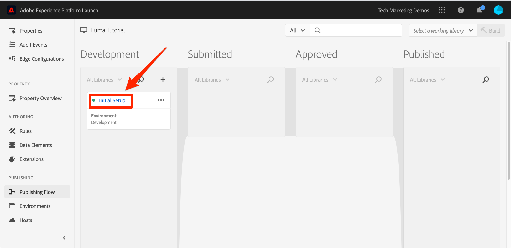

# 데이터 요소, 규칙 및 라이브러리 추가

이 단원에서는 첫 번째 데이터 요소, 규칙 및 라이브러리를 만듭니다.

데이터 요소 및 규칙 은 태그의 기본 구성 요소입니다. 데이터 요소는 마케팅 및 광고 솔루션에 전송할 특성을 저장하는 반면, 규칙은 올바른 조건에서 해당 솔루션에 대한 요청을 실행합니다.  라이브러리는 모든 작업을 수행하기 위해 페이지에 로드되는 JavaScript 파일입니다. 이 단원에서는 세 가지 방법을 모두 사용하여 샘플 페이지에서 작업이 수행되게 합니다.

>[!NOTE]
>
>Adobe Experience Platform Launch은 데이터 수집 기술군으로 Adobe Experience Platform에 통합되고 있습니다. 이 콘텐츠를 사용하는 동안 알아야 하는 몇 가지 용어 변경 사항이 인터페이스에 롤아웃되었습니다.
>
> * Platform launch(Client Side)가 이제 **[[!DNL tags]](https://experienceleague.adobe.com/docs/experience-platform/tags/home.html?lang=ko)**&#x200B;입니다.
> * 이제 platform launch 서버측이 **[[!DNL event forwarding]](https://experienceleague.adobe.com/docs/experience-platform/tags/event-forwarding/overview.html?lang=ko)**&#x200B;입니다.
> * 이제 Edge 구성이 **[[!DNL datastreams]](https://experienceleague.adobe.com/docs/experience-platform/edge/fundamentals/datastreams.html?lang=ko)**&#x200B;입니다.

## 학습 목표

이 단원을 마치면 다음을 수행할 수 있습니다.

* 데이터 요소 만들기
* 규칙 만들기
* 라이브러리 만들기
* 라이브러리에 변경 사항 추가
* 웹 브라우저에 라이브러리가 로드되는지 확인
* 작업 라이브러리 기능을 사용하여 보다 효율적으로 작업

## 페이지 이름에 대한 데이터 요소 만들기

데이터 요소는 데이터 계층의 태그 버전입니다. 고유한 데이터 계층 개체, 쿠키, 로컬 저장소 개체, 쿼리 문자열 매개 변수, 페이지 요소, 메타 태그 등의 값을 저장할 수 있습니다. 이 연습에서는 나중에 Target 및 Analytics 구현에서 사용할 페이지 이름에 대한 데이터 요소를 만듭니다.

**데이터 요소를 만들려면**

1. 왼쪽 탐색에서 **[!UICONTROL 데이터 요소]**&#x200B;를 클릭합니다

1. 이 속성에서 데이터 요소를 아직 만들지 않았기 때문에 이 주제에 대한 추가 정보가 포함된 간단한 비디오가 표시됩니다. 원하는 경우 이 비디오를 시청할 수 있습니다.

1. **[!UICONTROL 새 데이터 요소 만들기]** 단추를 클릭합니다.

   

1. 데이터 요소에 대한 이름을 지정합니다(예: `Page Name`).

1. [!UICONTROL JavaScript 변수] 데이터 요소 유형을 사용하여 샘플 페이지의 데이터 계층에 있는 값을 가리킵니다. `digitalData.page.pageInfo.pageName`

1. **[!UICONTROL 소문자 값 강제 적용]** 및 **[!UICONTROL 클린 텍스트]** 상자를 체크하여 케이스를 표준화하고 외부 공백을 제거합니다

1. 이 값은 일반적으로 모든 페이지에서 달라지므로 **[!UICONTROL 없음]**&#x200B;을(를) **[!UICONTROL 저장 유지 시간]** 설정으로 둡니다.

1. 데이터 요소를 저장하려면 **[!UICONTROL 저장]** 단추를 클릭하십시오.

   

>[!NOTE]
>
>데이터 요소 기능 _은(는) 확장을 사용하여 확장_&#x200B;할 수 있습니다. 예를 들면 ContextHub 확장을 사용하면 확장 기능을 사용하여 데이터 요소를 추가할 수 있습니다.

## 규칙 만들기

다음으로 단순 규칙에서 이 데이터 요소를 사용합니다. 규칙은 태그에서 가장 강력한 기능 중 하나이며 방문자가 웹 사이트와 상호 작용할 때 일어나야 하는 일을 지정할 수 있습니다. 규칙에 요약된 기준이 충족되면 규칙은 사용자가 지정한 작업을 트리거합니다.

페이지 이름 데이터 요소 값을 브라우저 콘솔에 출력하는 규칙을 만들려고 합니다.

**규칙을 만들려면**

1. 왼쪽 탐색에서 **[!UICONTROL 규칙]**&#x200B;을 클릭합니다

1. 이 속성에서 규칙을 아직 만들지 않았기 때문에 주제에 대한 추가 정보가 포함된 간단한 비디오가 표시됩니다. 원하는 경우 이 비디오를 시청할 수 있습니다.

1. **[!UICONTROL 새 규칙 만들기]** 단추를 클릭합니다.

   

1. 규칙 이름을 `All Pages - Library Loaded`로 지정합니다. 이 명명 규칙은 규칙이 실행되는 위치와 시기를 나타내므로 태그 속성이 발달함에 따라 보다 쉽게 식별하고 다시 사용할 수 있습니다.

1. 이벤트 아래에서 **[!UICONTROL 추가]**&#x200B;를 클릭합니다. 이벤트는 규칙을 언제 실행해야 하는지, 규칙이 언제 페이지 로드, 클릭, 사용자 지정 JavaScript 이벤트 등 많은 항목에 해당할 수 있는지에 태그에 알려줍니다.

   

   1. 이벤트 유형으로 **[!UICONTROL 로드된 라이브러리(페이지 상단)]**&#x200B;를 선택합니다. 이벤트 유형을 선택하면 태그가 선택 항목을 사용하여 이벤트의 이름을 미리 채웁니다. 또한 이벤트의 기본 순서는 50입니다. 순서 지정은 동일한 이벤트에서 트리거되는 규칙이 여러 개 있을 때 작업 시퀀스를 정확하게 제어할 수 있는 태그의 강력한 기능입니다. 이 기능은 이 자습서에서 나중에 사용하게 됩니다.

   1. **[!UICONTROL 변경 내용 유지]** 단추를 클릭합니다.

   

1. 이 규칙은 모든 페이지에서 실행되어야 하므로 **[!UICONTROL 조건]**&#x200B;을 비워 둡니다. 조건 모달을 열면 URL, 데이터 요소 값, 날짜 범위 등 다양한 옵션을 기준으로 하여 조건에서 제한과 예외를 모두 추가할 수 있음을 알 수 있습니다.

1. 작업에서 **[!UICONTROL 추가]**&#x200B;를 클릭합니다.

1. **[!UICONTROL 작업 유형 > 사용자 지정 코드]**&#x200B;을(를) 선택합니다. 이 시점의 유일한 옵션입니다. 튜토리얼의 후반부에 확장을 추가하면 더 많은 옵션을 사용할 수 있게 됩니다.

1. **[!UICONTROL &lt;/> 편집기 열기]**&#x200B;를 선택하여 코드 편집기를 엽니다.

   

1. 코드 편집기에 다음 내용을 추가합니다. 이 코드는 페이지 이름 데이터 요소의 값을 브라우저 콘솔로 출력하여 제대로 작동하는지 확인합니다.

   ```javascript
   console.log('The page name is '+_satellite.getVar('Page Name'));
   ```

1. 코드 편집기를 저장합니다.

   

1. 작업 구성 화면에서 **[!UICONTROL 변경 내용 유지]**&#x200B;를 클릭합니다.

1. 규칙을 저장하려면 **[!UICONTROL 저장]**&#x200B;을 클릭하세요.

규칙 페이지에 새 규칙이 표시됩니다.


## 라이브러리에 변경 사항 저장

데이터 수집 인터페이스에서 확장, 데이터 요소 및 규칙 컬렉션을 구성한 후에는 이러한 기능과 로직을 웹 사이트에 배포할 수 있는 JavaScript 코드 세트에 패키지화 해야 방문자가 사이트를 방문할 때 마케팅 태그가 실행됩니다. 라이브러리는 이 작업을 수행하는 JavaScript 코드 세트입니다.

이전 단원에서 샘플 페이지에 개발 환경의 포함 코드를 구현했습니다. 샘플 페이지를 로드할 때 태그 라이브러리가 환경에 아직 빌드 및 할당되지 않았기 때문에 포함 코드 URL에 대해 404 오류가 반환되었습니다. 이제 샘플 페이지에서 작업을 수행할 수 있도록 새로운 데이터 요소와 규칙을 라이브러리에 추가합니다.

**라이브러리를 추가하고 만들려면**

1. 왼쪽 탐색에서 **[!UICONTROL 게시 플로우]**&#x200B;를 클릭합니다.

1. **[!UICONTROL 새 라이브러리 추가]** 클릭

   

1. 라이브러리 이름을 지정합니다(예: `Initial Setup`).

1. **[!UICONTROL 환경 > 개발]** 선택

1. **[!UICONTROL 변경된 모든 리소스 추가]** 클릭

   

1. **[!UICONTROL 변경된 모든 리소스 추가]** 태그를 클릭하면 방금 변경한 내용이 요약됩니다.

1. **[!UICONTROL 개발을 위한 저장 및 빌드]**&#x200B;를 클릭합니다.

   

잠시 후 상태 점이 라이브러리가 성공적으로 빌드되었음을 나타내는 녹색으로 바뀝니다.



## 작업 내용의 유효성 검사

이제 규칙이 예상대로 작동하는지 확인합니다.

샘플 페이지를 다시 로드합니다. Developer Tools -> Network 탭을 보면 이제 태그 라이브러리에 대한 200개의 응답이 표시됩니다.


개발자 도구 -> 콘솔을 보면 &quot;The page name is home&quot;이라는 텍스트가 표시됩니다.


축하합니다. 첫 번째 데이터 요소와 규칙을 만들고 첫 번째 태그 라이브러리를 빌드했습니다!

## 작업 라이브러리 기능 사용

태그를 많이 변경할 때는 게시 탭으로 와서 변경 사항을 추가하고, 결과를 확인할 때마다 라이브러리를 빌드해야 하는 번거로움이 없습니다.  이제 &quot;초기 설정&quot; 라이브러리를 만들었으므로 &quot;작업 라이브러리&quot;라는 기능을 사용하여 변경 사항을 신속하게 저장하고 라이브러리를 한 단계로 다시 빌드할 수 있습니다.

All Pages - Library Loaded 규칙을 약간 변경합니다. 왼쪽 탐색에서 **[!UICONTROL 규칙]**&#x200B;을 클릭한 다음 `All Pages - Library Loaded` 규칙을 클릭하여 엽니다.


`Edit Rule` 페이지에서 ***[!UICONTROL 작업 라이브러리]*** 드롭다운을 클릭하고 `Initial Setup` 라이브러리를 선택합니다.


라이브러리를 선택하면 이제 **[!UICONTROL 저장]** 단추의 기본값이 **[!UICONTROL 라이브러리에 저장]**&#x200B;으로 설정됩니다. 태그를 변경할 때 이 옵션을 사용하여 작업 라이브러리에 직접 변경 사항을 자동으로 추가하거나 다시 빌드할 수 있습니다.

테스트해 보십시오. 사용자 지정 코드 작업을 열고 &quot;The page name is&quot; 텍스트 뒤에 콜론을 추가하여 전체 코드 블록이 다음과 같이 표시되는지 확인합니다.

```javascript
console.log('The page name is: '+_satellite.getVar('Page Name'));
```

코드를 저장하고 작업의 변경 내용을 유지한 다음 이제 **[!UICONTROL 라이브러리 및 빌드에 저장]** 단추를 클릭합니다.


[!UICONTROL 작업 라이브러리] 드롭다운 옆에 녹색 점이 다시 나타날 때까지 잠시 기다립니다. 이제 샘플 페이지를 다시 로드하면 콘솔 메시지에 반영된 변경 사항이 표시됩니다(페이지 변경 사항을 보려면 브라우저 캐시를 지우고 다시 로드해야 할 수 있음).


이 방법이 훨씬 더 빨리 작업할 수 있으므로 이 자습서의 나머지 부분에서 이 접근 방식을 사용하겠습니다.

[다음 &quot;Experience Cloud Debugger으로 환경 전환&quot; >](switch-environments.md)
