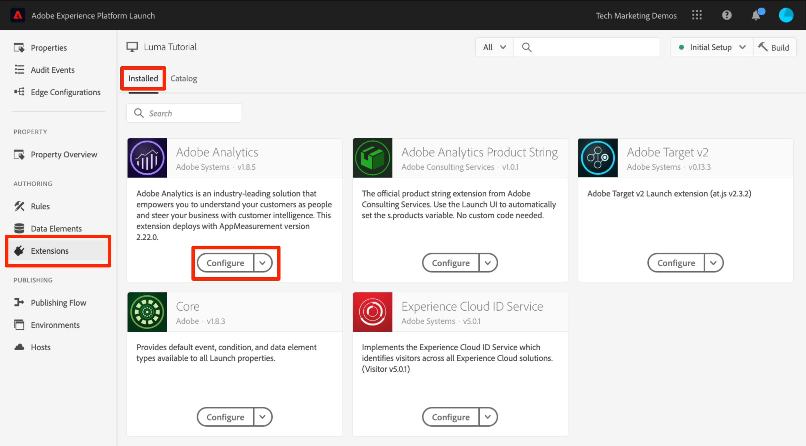

# Adobe Analytics 추가

이 단원에서는 [Adobe Analytics 확장](https://experienceleague.adobe.com/docs/experience-platform/tags/extensions/adobe/analytics/overview.html)을 구현하고 데이터를 Adobe Analytics에 전송하는 규칙을 만듭니다.

[Adobe Analytics](https://experienceleague.adobe.com/docs/analytics.html?lang=ko-KR)는 고객 인텔리전스로 고객을 사람으로 이해하고 고객 인텔리전스로 비즈니스를 이끌어 나갈 수 있는 업계 선도적인 솔루션입니다.

>[!NOTE]
>
>Adobe Experience Platform Launch은 데이터 수집 기술군으로 Adobe Experience Platform에 통합되고 있습니다. 이 콘텐츠를 사용하는 동안 알아야 하는 몇 가지 용어 변경 사항이 인터페이스에 롤아웃되었습니다.
>
> * Platform launch(Client Side)가 이제 **[[!DNL tags]](https://experienceleague.adobe.com/docs/experience-platform/tags/home.html)**&#x200B;입니다.
> * 이제 platform launch 서버측이 **[[!DNL event forwarding]](https://experienceleague.adobe.com/docs/experience-platform/tags/event-forwarding/overview.html)**&#x200B;입니다.
> * 이제 Edge 구성이 **[[!DNL datastreams]](https://experienceleague.adobe.com/docs/experience-platform/edge/fundamentals/datastreams.html)**&#x200B;입니다.

## 학습 목표

이 단원을 마치면 다음을 수행할 수 있습니다.

1. Adobe Analytics 확장 추가
1. 확장을 사용하여 글로벌 변수 설정
1. 페이지 보기 비콘 추가
1. 규칙을 사용하여 추가 변수 추가
1. 클릭 추적 및 기타 이벤트 기반 비콘 추가
1. Analytics 플러그인 추가

태그의 Analytics에 대해 구현할 수 있는 여러 가지 사항이 있습니다. 이 단원은 완벽하지는 않지만, 사용자 사이트에서 구현에 필요한 주요 기술에 대한 구체적인 개요를 제공합니다.

## 전제 조건

[태그 구성](create-a-property.md) 및 [ID 서비스 추가](id-service.md)의 학습 내용을 이미 완료했어야 합니다.

추가적으로, 하나 이상의 보고서 세트 ID와 추적 서버가 필요합니다. 이 자습서에 사용할 수 있는 테스트/개발 보고서 세트가 없는 경우 만드십시오. 방법을 잘 모르는 경우 [설명서](https://experienceleague.adobe.com/docs/analytics/admin/manage-report-suites/new-report-suite/new-report-suite.html?lang=ko-KR)를 참조하십시오. 현재 구현, Adobe 컨설턴트 또는 고객 지원 담당자로부터 추적 서버를 검색할 수 있습니다.

## Analytics 확장 구성 추가

Analytics 확장은 다음 두 가지 주요 부분으로 구성됩니다.

1. 확장 구성: 코어 AppMeasurement.js 라이브러리 설정을 관리하고 글로벌 변수를 설정할 수 있음
1. 규칙 작업: 다음을 수행합니다.
   1. 변수 설정
   1. 변수 지우기
   1. Analytics 비콘 보내기

**Analytics 확장을 추가하려면**

1. **[!UICONTROL 확장 > 카탈로그]**(으)로 이동
1. Adobe Analytics 확장을 찾습니다.
1. **[!UICONTROL 설치]** 클릭

   

1. [!UICONTROL 라이브러리 관리 > 보고서 세트]에서 각 태그 환경에 사용할 보고서 세트 ID를 입력합니다. 사용자가 Adobe Analytics에 액세스할 수 있는 경우 상자에 입력을 시작하면 모든 보고서 세트의 미리 채워진 목록이 표시됩니다. (이 자습서에서는 모든 환경에 대해 하나의 보고서 세트를 사용할 수 있지만 실제 환경에서는 아래 이미지와 같이 별도의 보고서 세트를 사용합니다.)

   

   >[!TIP]
   >
   >`AppMeasurement.js` 라이브러리를 더 쉽게 최신 상태로 유지할 수 있도록 [!UICONTROL Manage the library for me 옵션]을 [!UICONTROL Library Management] 설정으로 사용하는 것이 좋습니다.

1. [!UICONTROL 일반 > 추적 서버]에서 추적 서버(예: `tmd.sc.omtrdc.net`)를 입력하십시오. 사이트가 `https://`를 지원하는 경우 SSL 추적 서버를 입력합니다.

   

1. [!UICONTROL 전역 변수 섹션]의 [!UICONTROL 추가 설정]에서 `Page Name` 데이터 요소를 사용하여 [!UICONTROL 페이지 이름] 변수를 설정합니다.  아이콘을 클릭하여 모달을 열고 페이지 `Page Name` 데이터 요소를 선택합니다.

1. **[!UICONTROL 라이브러리에 저장]** 클릭

   

>[!NOTE]
>
>전역 변수는 확장 구성 또는 규칙 작업에서 설정할 수 있습니다. 확장 구성에서 변수를 설정할 때 태그 포함 코드를 *이전*&#x200B;에 데이터 계층을 정의해야 합니다.

## 페이지 보기 비콘 보내기

이제 Analytics 비콘이 실행되는 규칙을 만들겠습니다. 이 규칙은 확장 구성에 설정된 [!UICONTROL 페이지 이름] 변수를 전송합니다.

이미 이 자습서의 [데이터 요소, 규칙 및 라이브러리 추가](add-data-elements-rules.md) 단원에서 태그 라이브러리가 로드될 때 모든 페이지에서 트리거되는 &quot;All Pages - Library Loaded&quot; 규칙을 만들었습니다. Analytics에도 이 규칙을 사용할 수 *있습니다*. 그러나 이 설정을 사용하려면 Analytics 비콘에 사용된 모든 데이터 레이어 특성을 태그 포함 코드 앞에 정의해야 합니다. 데이터 수집을 보다 유연하게 하려면, DOM 지원에서 트리거된 새로운 &quot;모든 페이지&quot; 규칙을 만들어 Analytics 비콘을 실행합니다.

**페이지 보기 비콘을 보내려면**

1. 왼쪽 탐색에서 **[!UICONTROL 규칙]** 섹션으로 이동한 다음 **[!UICONTROL 규칙 추가]**&#x200B;를 클릭합니다

   

1. 규칙 이름을 지정합니다 `All Pages - DOM Ready`
1. **[!UICONTROL 이벤트 > 추가]**&#x200B;를 클릭하여 `Event Configuration` 화면을 엽니다.

   

1. **[!UICONTROL 이벤트 유형 > DOM 준비]**&#x200B;를 선택합니다(규칙 순서는 &quot;50&quot;).
1. **[!UICONTROL 변경 내용 유지]** 클릭
   

1. Actions 아래에 있는 을 클릭하여 새 작업을 추가합니다.

   

1. **[!UICONTROL 확장 > Adobe Analytics]** 선택

1. **[!UICONTROL Action Type > Send Beacon]** 선택

1. 추적을 `s.t()`로 설정된 대로 둡니다. 클릭 이벤트 규칙에서 `s.tl()`을 호출하려는 경우 비콘 보내기 작업을 사용할 수도 있습니다.

1. **[!UICONTROL 변경 내용 유지]** 단추를 클릭합니다.

   

1. **[!UICONTROL 라이브러리 및 빌드에 저장]**&#x200B;을 클릭합니다.

   

### 페이지 보기 비콘 유효성 검사

Analytics 비콘을 보내는 규칙을 만들었으면 이제 Experience Cloud Debugger에서 요청을 볼 수 있습니다.

1. Chrome 브라우저에서 [Luma 사이트](https://luma.enablementadobe.com/content/luma/us/en.html)를 엽니다.
1. 디버거 아이콘 를 클릭하여 **[!UICONTROL Adobe Experience Cloud Debugger]**&#x200B;를 엽니다.
1. [이전 단원](switch-environments.md)에 설명된 대로 Debugger가 태그 속성을 *사용자* 개발 환경에 매핑하는지 확인합니다.

   

1. 클릭하여 Analytics 탭을 엽니다.
1. 보고서 세트 이름을 확장하여 해당 보고서 세트에 수행된 모든 요청을 표시합니다.
1. 요청이 페이지 이름 변수 및 값으로 실행되었는지 확인합니다

   

>[!NOTE]
>
>페이지 이름이 표시되지 않는 경우 이 페이지의 이전 단계로 이동하여 아무 것도 놓치지 않았는지 확인하십시오.

## 규칙을 사용하여 변수 추가

Analytics 확장을 구성할 때 확장 구성에서 `pageName` 변수를 입력했습니다. 태그 포함 코드가 로드되기 전에 페이지에서 값을 사용할 수 있는 경우 이 위치는 eVar 및 prop과 같은 다른 전역 변수를 입력하기에 적합합니다.

변수(이벤트도 마찬가지)를 설정하는 보다 유연한 위치는 `Set Variables` 작업을 사용하는 규칙에 있습니다. 규칙을 사용하면 다양한 조건에서 다른 Analytics 변수와 이벤트를 설정할 수 있습니다. 예를 들어 제품 세부 사항 페이지에서만 `prodView`를 설정하고 주문 확인 페이지에서만 `purchase` 이벤트를 설정할 수 있습니다. 이 섹션에서는 규칙을 사용하여 변수를 설정하는 방법을 알려줍니다.

### 사용 사례

PDP(Product Detail Page)는 소매 사이트에서 데이터 수집을 위한 중요한 지점입니다. 일반적으로, 제품 보기가 발생했을 때 Analytics에서 이 발생과 본 제품이 등록되게 하려고 합니다. 이는 고객에게 인기 있는 제품을 파악하는 데 도움이 됩니다. 미디어 사이트에서는, 이 섹션에서 사용하게 될 추적 기술과 유사한 추적 기술을 문서 또는 비디오 페이지에서 사용할 수 있습니다.  제품 세부 사항 페이지를 로드할 때 해당 값을 &quot;페이지 유형&quot; `eVar`에 입력하고 일부 이벤트와 제품 ID를 설정할 수 있습니다. 이렇게 하면 분석에서 다음을 확인할 수 있습니다.

1. 제품 세부 사항 페이지가 몇 번이나 로드됩니까
1. 어떤 제품을 보았으며, 몇 번이나 보았습니까
1. 사람들이 로드하는 PDP 수에 다른 요소(캠페인, 검색 등)가 어떻게 영향을 줍니까

### 페이지 유형에 대한 데이터 요소 만들기

먼저 제품 세부 사항 페이지를 확인해야 합니다. 이 작업은 데이터 요소를 사용하여 수행합니다.

**페이지 유형에 대한 데이터 요소를 만들려면**

1. 왼쪽 탐색에서 **[!UICONTROL 데이터 요소]**&#x200B;를 클릭합니다
1. **[!UICONTROL 데이터 요소 추가]** 클릭

   

1. 데이터 요소에 이름을 지정합니다 `Page Type`
1. **[!UICONTROL 데이터 요소 유형 > JavaScript 변수]** 선택
1. `digitalData.page.category.type`을(를) **[!UICONTROL JavaScript 변수 이름]**(으)로 사용
1. **[!UICONTROL 텍스트 정리]** 및 **[!UICONTROL 소문자 강제 적용]** 옵션을 확인하십시오.
1. **[!UICONTROL 라이브러리에 저장]** 클릭

   

### 제품 ID에 대한 데이터 요소 만들기

다음으로, 데이터 요소를 사용하여 현재 제품 세부 사항 페이지의 제품 ID를 수집합니다.

**제품 ID에 대한 데이터 요소를 만들려면**

1. 왼쪽 탐색에서 **[!UICONTROL 데이터 요소]**&#x200B;를 클릭합니다
1. **[!UICONTROL 데이터 요소 추가]** 클릭

   

1. 데이터 요소에 이름을 지정합니다 `Product Id`
1. **[!UICONTROL 데이터 요소 유형 > JavaScript 변수]** 선택
1. `digitalData.product.0.productInfo.sku`을(를) **[!UICONTROL JavaScript 변수 이름]**(으)로 사용
1. **[!UICONTROL 텍스트 정리]** 및 **[!UICONTROL 소문자 강제 적용]** 옵션을 확인하십시오.
1. **[!UICONTROL 라이브러리에 저장]** 클릭

   

### Adobe Analytics 제품 문자열 확장 추가

이미 Adobe Analytics 구현에 익숙하다면 [제품 변수](https://experienceleague.adobe.com/docs/analytics/implementation/vars/page-vars/products.html)에도 익숙할 것입니다. 제품 변수는 매우 특정한 구문을 사용하며, 컨텍스트에 따라 약간 다른 방식으로 사용됩니다. 태그에서 제품 변수를 더 쉽게 입력할 수 있도록 지원하기 위해 태그 확장 마켓플레이스에서 이미 3개의 추가 확장을 만들었습니다! 이 섹션에서는 제품 세부 정보 페이지에서 사용할 Adobe 컨설팅 팀이 만든 확장을 추가합니다.

**`Adobe Analytics Product String` 확장을 추가하려면**

1. [!UICONTROL Extensions > Catalog] 페이지로 이동합니다.
1. Adobe Consulting 서비스에서 `Adobe Analytics Product String` 확장을 찾아 **[!UICONTROL 설치]**&#x200B;를 클릭합니다.
   
1. 잠시 지침을 읽어 보십시오
1. **[!UICONTROL 라이브러리에 저장]** 클릭

   

### 제품 세부 사항 페이지에 대한 규칙 만들기

이제, 새 데이터 요소와 확장을 사용하여 제품 세부 사항 페이지 규칙을 만듭니다. 이 기능에 대해서는 DOM Ready에 의해 트리거된 다른 페이지 로드 규칙을 만듭니다. 하지만, 제품 세부 사항 페이지에서만 실행되도록 조건을 사용하고, 비콘을 보내는 규칙 _전에_ 실행되도록 순서 설정을 사용합니다.

**제품 세부 사항 페이지 규칙을 만들려면**

1. 왼쪽 탐색에서 **[!UICONTROL 규칙]** 섹션으로 이동한 다음 **[!UICONTROL 규칙 추가]**&#x200B;를 클릭합니다

   

1. 규칙 이름을 지정합니다 `Product Details - DOM Ready - 40`
1. **[!UICONTROL 이벤트 > 추가]**&#x200B;를 클릭하여 `Event Configuration` 화면을 엽니다.

   

1. **[!UICONTROL 이벤트 유형 > DOM 준비]** 선택
1. **[!UICONTROL Order]**&#x200B;을(를) 40으로 설정하여 Analytics > 비콘 보내기 작업이 포함된 규칙을 *이전*&#x200B;에 실행하도록 합니다.
1. **[!UICONTROL 변경 내용 유지]** 클릭
   

1. **[!UICONTROL 조건]**&#x200B;에서 하여 `Condition Configuration` 화면을 엽니다.
   

   1. **[!UICONTROL 조건 유형 > 값 비교]**&#x200B;를 선택합니다.
   1. 데이터 요소 선택기를 사용하여 첫 번째 필드에서 `Page Type`을 선택합니다.
   1. 비교 연산자 드롭다운에서 **[!UICONTROL 포함]** 선택
   1. 다음 필드에서 `product-page`(PDP의 데이터 레이어에서 가져온 페이지 유형 값의 고유한 부분임)를 입력합니다.
   1. **[!UICONTROL 변경 내용 유지]** 클릭

      

1. Actions 아래에 있는 을 클릭하여 새 작업을 추가합니다.

   

1. **[!UICONTROL 확장 > Adobe Analytics 제품 문자열]** 선택
1. **[!UICONTROL 작업 유형 > s.products 설정]** 선택

1. **[!UICONTROL Analytics 전자 상거래 이벤트]** 섹션에서 **[!UICONTROL prodView]**&#x200B;를 선택합니다.

1. **[!UICONTROL 제품 데이터에 대한 데이터 계층 변수]** 섹션에서 데이터 요소 선택기를 사용하여 `Product Id` 데이터 요소를 선택합니다

1. **[!UICONTROL 변경 내용 유지]** 클릭

   


1. Actions 아래에 있는 을 클릭하여 새 작업을 추가합니다.

   

1. **[!UICONTROL 확장 > Adobe Analytics]** 선택
1. **[!UICONTROL 작업 유형 > 변수 설정]** 선택
1. **[!UICONTROL eVar1 > 다음으로 설정]**&#x200B;을(를) 선택하고 `product detail page`을(를) 입력하십시오.
1. **[!UICONTROL event1]**&#x200B;을(를) 설정하고, 선택적 값을 비워둡니다.
1. 이벤트 아래에서 **[!UICONTROL 다른 항목 추가]** 단추를 클릭합니다.
1. **[!UICONTROL prodView]** 이벤트를 설정하고, 선택적 값을 비워둡니다.
1. **[!UICONTROL 변경 내용 유지]** 클릭

   

1. **[!UICONTROL 라이브러리 및 빌드에 저장]**&#x200B;을 클릭합니다.

   

### 제품 세부 사항 페이지 데이터 유효성 검사

비콘이 전송되기 전에 변수를 설정하는 규칙을 만들었습니다. 이제 Experience Cloud Debugger에서 새 데이터가 히트에서 나가는 것을 볼 수 있습니다.

**제품 세부 사항 페이지 데이터의 유효성을 검사하려면**

1. Chrome 브라우저에서 [Luma 사이트](https://luma.enablementadobe.com/content/luma/us/en.html)를 엽니다.
1. 제품 세부 사항 페이지로 이동합니다
1. 디버거 아이콘 를 클릭하여 **[!UICONTROL Adobe Experience Cloud Debugger]**&#x200B;를 엽니다.
1. Analytics 탭을 클릭하여 엽니다.
1. 보고서 세트를 확장합니다.
1. 이제 디버거에 있는 제품 세부 사항 변수를 확인합니다. 즉 `eVar1`이 &quot;product detail page&quot;로 설정되었고, `Events` 변수가 &quot;event1&quot; 및 &quot;prodView&quot;로 설정되었고, 제품 변수가 사용자가 보고 있는 제품의 제품 ID로 설정되었고, 페이지 이름을 아직 Analytics 확장에서 설정하는지 확인합니다.

   

## 추적 링크 비콘 보내기

페이지가 로드되면 일반적으로 `s.t()` 함수에 의해 트리거되는 페이지 로드 비콘을 실행합니다. 이렇게 하면 `pageName` 변수에 나열된 페이지에 대한 `page view` 지표가 자동으로 증가합니다.

하지만 수행하는 작업이 페이지 보기보다 &quot;더 작으므로&quot;(또는 페이지 보기와 다를 수 있으므로), 사이트에서 페이지 보기를 늘리고 싶지 않은 경우가 있을 수 있습니다. 이런 경우에는 `s.tl()` 함수를 사용합니다. 이 함수를 일반적으로 &quot;추적 링크&quot; 요청이라고도 합니다. 이것을 추적 링크 요청이라고 하지만, 링크 클릭 시 트리거되지 않아도 됩니다. 고유한 사용자 지정 JavaScript을 포함하여 태그 규칙 빌더에서 사용할 수 있는 이벤트의 *모든*&#x200B;에 의해 트리거될 수 있습니다.

이 자습서에서는 가장 멋진 JavaScript 이벤트 중 하나인 `Enters Viewport` 이벤트를 사용하여 `s.tl()` 호출을 트리거합니다.

### 사용 사례

이 사용 사례에서는 사람들이 Luma 홈 페이지에서 아래로 스크롤하여 페이지의 *주요 제품* 섹션을 볼 수 있는지 알려고 합니다. 사람들이 해당 섹션을 보고 있는지 여부에 대한 사내 의견 불일치가 있으므로 Analytics를 사용하여 진실을 파악하고자 합니다.

### 태그에 규칙 만들기

1. 왼쪽 탐색에서 **[!UICONTROL 규칙]** 섹션으로 이동한 다음 **[!UICONTROL 규칙 추가]**&#x200B;를 클릭합니다
   
1. 규칙 이름을 지정합니다 `Homepage - Featured Products enters Viewport`
1. **[!UICONTROL 이벤트 > 추가]**&#x200B;를 클릭하여 `Event Configuration` 화면을 엽니다.

   

1. **[!UICONTROL 이벤트 유형 > 뷰포트 입력]**&#x200B;을 선택합니다. 이렇게 하면 CSS 선택기를 입력해야 하는 필드가 표시됩니다. 이 선택기는 페이지에서 규칙이 브라우저에서 뷰에 들어올 때 규칙을 트리거해야 하는 항목을 식별합니다.
1. Luma의 홈 페이지로 돌아가 추천 제품 섹션으로 스크롤합니다.
1. &quot;주요 제품&quot; 제목과 이 섹션의 항목 사이에 있는 공백을 마우스 오른쪽 단추로 클릭하고 마우스 오른쪽 단추 클릭 메뉴에서 `Inspect`을(를) 선택합니다. 이렇게 하면 원하는 내용에 가까워집니다.
1. 바로 그 주변(선택한 섹션 바로 아래일 수 있음)에서 `class="we-productgrid aem-GridColumn aem-GridColumn--default--12"`를 사용하는 div가 있을 것입니다. 이 요소를 찾습니다.
1. 이 요소를 마우스 오른쪽 단추로 클릭하고 **[!UICONTROL 복사 > 복사 선택기]**&#x200B;를 선택합니다.

   

1. 태그로 돌아가서 클립보드의 이 값을 `Elements matching the CSS selector` 필드에 붙여 넣습니다.
   1. 참고로, CSS 선택기를 식별하는 방법을 결정하는 것은 여러분에게 달려 있습니다. 페이지의 특정 변경 사항이 이 선택기를 손상시킬 수 있으므로 이 방법은 약간 취약할 수 있습니다. 태그에서 CSS 선택기를 사용할 때는 이를 고려하십시오.
1. **[!UICONTROL 변경 내용 유지]** 클릭
   

1. Conditions 아래에 있는 을 클릭하여 새 조건을 추가합니다.
1. **[!UICONTROL 조건 유형 > 값 비교]**&#x200B;를 선택합니다.
1. 데이터 요소 선택기를 사용하여 첫 번째 필드에서 `Page Name`을 선택합니다.
1. 비교 연산자 드롭다운에서 **[!UICONTROL 같음]** 선택
1. 다음 필드에서 `content:luma:us:en`(데이터 레이어에서 가져온 홈 페이지의 페이지 이름임. 홈 페이지에서만 이 규칙을 실행하려고 함)을 입력합니다.
1. **[!UICONTROL 변경 내용 유지]** 클릭

   

1. Actions 아래에 있는 을 클릭하여 새 작업을 추가합니다.
1. **[!UICONTROL 확장 > Adobe Analytics]** 선택
1. **[!UICONTROL 작업 유형 > 변수 설정]** 선택
1. `eVar3`을 `Home Page - Featured Products`로 설정합니다.
1. `prop3`을 `Home Page - Featured Products`로 설정합니다.
1. `Events` 변수를 `event3`으로 설정합니다.
1. **[!UICONTROL 변경 내용 유지]** 클릭

   

1. Actions 아래에 있는 을 클릭하여 다른 새 작업을 추가합니다.

1. **[!UICONTROL 확장 > Adobe Analytics]** 선택
1. **[!UICONTROL Action Type > Send Beacon]** 선택
1. **[!UICONTROL `s.tl()`]** 추적 옵션 선택
1. **[!UICONTROL 링크 이름]** 필드에 `Scrolled down to Featured Products`을(를) 입력하십시오. 이 값은 Analytics의 사용자 지정 링크 보고서에 입력됩니다.
1. **[!UICONTROL 변경 내용 유지]** 클릭

   

1. **[!UICONTROL 라이브러리 및 빌드에 저장]**&#x200B;을 클릭합니다.

   

### 추적 링크 비콘 유효성 검사

이제 당사 사이트 홈 페이지의 주요 제품 섹션으로 스크롤할 때 이 히트가 발생하는지 확인하려고 합니다. 홈 페이지를 처음 로드할 때 요청이 만들어지지 않지만 아래로 스크롤하여 섹션이 표시되면 새 값으로 히트가 실행됩니다.

1. Chrome 브라우저에서 [Luma 사이트](https://luma.enablementadobe.com/content/luma/us/en.html)를 열고 현재 위치가 홈 페이지의 상단인지 확인합니다.
1. **[!UICONTROL 디버거 아이콘]** 를 클릭하여 [!UICONTROL Adobe Experience Cloud 디버거]를 엽니다.
1. Analytics 탭을 클릭하여 엽니다.
1. 보고서 세트의 히트를 확장합니다.
1. 페이지 이름 등이 있는 홈 페이지의 일반 페이지 보기 히트에 주목합니다(하지만 eVar3 또는 prop3에는 아무 것도 없음).

   

1. 디버거를 연 채로 추천 제품 섹션이 표시될 때까지 사이트에서 아래로 스크롤합니다.
1. 디버거를 다시 봅니다. 그러면 다른 Analytics 히트가 표시됩니다. 이 히트에는 사용자가 설정한 s.tl() 히트와 관련된 매개 변수가 있어야 합니다. 즉, 다음과 같습니다.
   1. `LinkType = "link_o"`(히트가 페이지 보기 히트가 아닌 사용자 지정 링크 히트임을 의미합니다.)
   1. `LinkName = "Scrolled down to Featured Products"`
   1. `prop3 = "Home Page - Featured Products"`
   1. `eVar3 = "Home Page - Featured Products"`
   1. `Events = "event3"`

      

## 플러그인 추가

플러그인은 구현에 추가하여 제품에 빌드되지 않은 특정 기능을 수행할 수 있는 JavaScript 코드 부분입니다. 플러그인은 사용자, 다른 Adobe 고객/파트너나 Adobe 컨설팅 팀이 빌드할 수 있습니다.

플러그인을 구현하려면 기본적으로 다음 세 단계를 수행해야 합니다.

1. 플러그인을 참조할 doPlugins 함수를 포함합니다.
1. 플러그인에 대한 main 함수 코드를 추가합니다
1. 함수 호출, 변수 설정 등을 수행하는 코드를 포함합니다.

### Analytics 개체를 전체적으로 액세스할 수 있게 만들기

doPlugins 함수(아래)를 추가하고 플러그인을 사용하려는 경우 Analytics 구현 시 Analytics &quot;s&quot; 개체를 전체적으로 사용할 수 있도록 지정하는 상자를 선택해야 합니다.

1. **[!UICONTROL Extensions > Installed]**(으)로 이동

1. Adobe Analytics 확장에서 **[!UICONTROL 구성]**&#x200B;을 클릭합니다.

   

1. **[!UICONTROL 라이브러리 관리]**&#x200B;에서 `Make tracker globally accessible` 상자를 선택합니다. 도움말 풍선에서 볼 수 있듯이 이렇게 하면 window.s에서 전체적으로 추적기를 사용할 수 있으며, 이것은 고객 JavaScript에서 추적기를 참조할 때 매우 중요합니다.
   

### doPlugins 함수 포함

플러그인을 추가하려면 doPlugins 함수를 추가해야 합니다. 이 함수는 기본적으로 추가되지는 않지만 일단 추가되면 AppMeasurement 라이브러리에서 처리되며 히트가 Adobe Analytics로 전송될 때 마지막으로 호출됩니다. 따라서 이 함수를 사용하여 이 방식으로 쉽게 설정된 변수를 설정하는 일부 JavaScript를 실행할 수 있습니다.

1. 아직 Analytics 확장에 있을 때 아래로 스크롤하여 `Configure Tracker Using Custom Code.`라는 섹션을 확장합니다.
1. **[!UICONTROL 편집기 열기]**&#x200B;를 클릭합니다
1. 다음 코드를 코드 편집기에 붙여넣습니다.

   ```javascript
   /* Plugin Config */
   s.usePlugins=true
   s.doPlugins=function(s) {
   /* Add calls to plugins here */
   }
   ```

1. 다음 단계를 위해 이 창을 열어 두십시오

### 플러그인에 대한 함수 코드 추가

이 코드에서는 두 플러그인을 실제로 호출하려고 하지만, 그 중 하나는 AppMeasurement 라이브러리에 내장되어 있으므로 이에 대해서는 호출할 함수를 추가할 필요가 없습니다. 하지만 두 번째 플러그인의 경우에는 함수 코드도 추가해야 합니다. 이 함수를 getValOnce()라고 합니다.

### getValOnce() 플러그인

이 플러그인의 목적은 방문자가 페이지를 새로 고치거나 브라우저의 뒤로 단추를 사용하여 값이 설정된 페이지로 돌아갈 때 코드에서 값이 잘못 중복되는 것을 방지하기 위한 것입니다. 이 단원에서는 이 플러그인을 사용하여 `clickthrough` 이벤트가 중복되지 않도록 합니다.

이 플러그인의 코드는 [Analytics 설명서](https://experienceleague.adobe.com/docs/analytics/implementation/vars/plugins/getvalonce.html)에 나와 있지만 쉽게 복사/붙여넣기를 할 수 있도록 여기에 포함되어 있습니다.

1. 다음 코드를 복사합니다.

   ```javascript
   /* Adobe Consulting Plugin: getValOnce v2.01 */
   s.getValOnce=function(vtc,cn,et,ep){if(vtc&&(cn=cn||"s_gvo",et=et||0,ep="m"===ep?6E4:864E5,vtc!==this.c_r(cn))){var e=new Date;e.setTime(e.getTime()+et*ep);this.c_w(cn,vtc,0===et?0:e);return vtc}return""};
   ```

1. Analytics 확장의 코드 창에 붙여 넣습니다(아직 열지 않은 경우 이전 단계에 따라 다시 엽니다.). doPlugins 함수의 **완전히 아래**&#x200B;에 붙여 넣으십시오(내부가 아님).

   

이제 doPlugins 내에서 이 플러그인을 호출할 수 있습니다.

### doPlugins 내에서 플러그인 호출

이제 코드가 해당 위치에 있고 참조할 수 있으므로 doPlugins 함수 내에서 플러그인을 호출할 수 있습니다.

우선 AppMeasurement 라이브러리에 통합되어 있으며 &quot;유틸리티&quot;라고도 하는 플러그인을 호출합니다. s 개체의 일부이고 기본 제공 유틸리티이며 URL에서 쿼리 문자열의 매개 변수를 기반으로 하여 값을 가져오므로 `s.Util.getQueryParam`이라고도 합니다.

1. 다음 코드를 복사합니다.

   ```javascript
   s.campaign = s.Util.getQueryParam("cid");
   ```

1. doPlugins 함수에 붙여 넣습니다. 이렇게 하면 현재 페이지 URL에서 `cid`라는 매개 변수를 찾아서 s.campaign 변수에 배치합니다.
1. 이제 다음 코드를 복사하고 getQueryParam 호출 바로 아래에 붙여 넣어 getValOnce 함수를 호출합니다.

   ```javascript
   s.campaign=s.getValOnce(s.campaign,'s_cmp',30);
   ```

   이 코드는 30일 동안 한 행에 동일한 값이 두 번 이상 전송되지 않도록 합니다(이 코드를 필요에 맞게 사용자 지정하는 방법은 설명서 참조).

   

1. 코드 창을 저장합니다
1. **[!UICONTROL 라이브러리 및 빌드에 저장]**&#x200B;을 클릭합니다.

   

### 플러그인 유효성 검사

이제 플러그인이 작동하는지 확인할 수 있습니다.

**플러그인의 유효성을 검사하려면**

1. Chrome 브라우저에서 [Luma 사이트](https://luma.enablementadobe.com/content/luma/us/en.html)를 엽니다.
1. 디버거 아이콘 를 클릭하여 **[!UICONTROL Adobe Experience Cloud Debugger]**&#x200B;를 엽니다.
1. Analytics 탭을 클릭하여 엽니다.
1. 보고서 세트를 확장합니다.
1. Analytics 히트에 캠페인 변수가 없다는 점에 주목합니다.
1. 디버거를 연 채로 Luma 사이트로 돌아가서 URL에 `?cid=1234`를 추가한 다음, Enter 키를 눌러 포함된 해당 쿼리 문자열로 페이지를 새로 고칩니다.

   

1. 디버거를 확인하고 캠페인 변수가 `1234`로 설정된 두 번째 Analytics 요청이 있는지 확인합니다.

   

1. 다시 돌아가서 URL에 쿼리 문자열을 사용하여 Luma 페이지를 다시 새로 고칩니다.
1. 디버거에서 그 다음 히트를 확인합니다. 그러면 getValOnce 플러그인으로 인해 이 변수가 중복되지 않고 다른 사람이 캠페인 추적 코드를 통해 온 것처럼 보이도록 했으므로 이 캠페인 변수가 **없어야** 합니다.

   

1. 보너스: 쿼리 문자열에서 `cid` 매개 변수의 값을 변경하여 이 작업을 반복해서 테스트할 수 있습니다. Campaign 변수는 값이 있는 페이지를 **처음** 실행할 때만 있어야 합니다. 디버거에 Campaign 값이 보이지 않는 경우 URL의 쿼리 문자열에서 `cid` 값을 변경한 다음을 Enter 키를 누릅니다. 그러면 다시 디버거에 표시됩니다.

   >[!NOTE]
   >
   >실제로 Analytics 확장 구성에 포함하여 URL의 쿼리 문자열에서 매개 변수를 가져오는 방법은 여러 가지가 있습니다. 그러나 이러한 다른 비플러그인 옵션에서는 getValOnce 플러그인을 사용하여 여기서 수행한 것처럼 불필요한 중복을 방지하는 기능을 제공하지 않습니다. 이것은 작성자가 즐겨 사용하는 방법이고, 여러분은 여러분과 여러분의 요구 사항에 가장 적합한 방법을 결정해야 합니다.

잘 했습니다. Analytics 단원을 완료했습니다. 물론 Analytics 구현 향상을 위해 수행할 수 있는 다른 많은 작업이 있지만, 이를 통해 나머지 요구 사항을 처리할 수 있는 핵심 기술이 어느 정도 갖춰졌으면 합니다.

[다음 &quot;Adobe Audience Manager 추가&quot; >](audience-manager.md)
