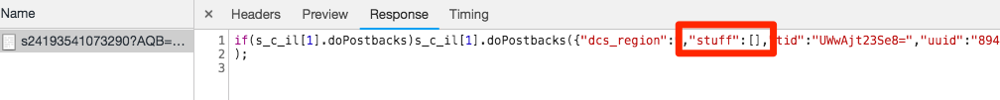

# Adobe Audience Manager 추가

이 단원에서는 서버측 전달을 사용하여 Adobe Audience Manager를 활성화하는 절차를 안내합니다.

[Adobe Audience Manager](https://experienceleague.adobe.com/docs/audience-manager/user-guide/aam-home.html?lang=ko)(AAM)는 온라인 대상 데이터 관리를 위해 디지털 광고주와 게시자에게 매출 성과를 높이는 데 도움이 되도록 데이터 자산을 제어하고 활용하는 데 필요한 도구를 제공하는 업계 선두 서비스를 제공합니다.

>[!NOTE]
>
>Adobe Experience Platform Launch은 데이터 수집 기술군으로 Adobe Experience Platform에 통합되고 있습니다. 이 콘텐츠를 사용하는 동안 알아야 하는 몇 가지 용어 변경 사항이 인터페이스에 롤아웃되었습니다.
>
> * Platform launch(Client Side)가 이제 **[[!DNL tags]](https://experienceleague.adobe.com/docs/experience-platform/tags/home.html?lang=ko)**&#x200B;입니다.
> * 이제 platform launch 서버측이 **[[!DNL event forwarding]](https://experienceleague.adobe.com/docs/experience-platform/tags/event-forwarding/overview.html?lang=ko)**&#x200B;입니다.
> * 이제 Edge 구성이 **[[!DNL datastreams]](https://experienceleague.adobe.com/docs/experience-platform/edge/fundamentals/datastreams.html?lang=ko)**&#x200B;입니다.

## 학습 목표

이 단원을 마치면 다음을 수행할 수 있습니다.

1. 웹 사이트에서 Audience Manager를 구현하는 두 가지 주요 방법 설명
1. Analytics 비콘의 서버측 전달을 사용하여 Audience Manager 추가
1. Audience Manager 구현의 유효성 검사

## 전제 조건

이 단원을 완료하려면

1. [태그 구성](create-a-property.md), [Adobe Analytics 추가](analytics.md) 및 [ID 서비스 추가](id-service.md)의 학습 내용을 완료해야 합니다.

1. 이 자습서에서 사용하는 보고서 세트에 대해 서버측 전달을 활성화할 수 있도록 Adobe Analytics에 대한 관리자 액세스 권한이 필요합니다. 또는 아래 지침에 따라 조직의 기존 관리자에게 이를 수행하도록 요청할 수 있습니다.

1. Audience Manager 하위 도메인이 필요합니다(&quot;파트너 이름&quot; &quot;파트너 ID&quot; 또는 &quot;파트너 하위 도메인&quot;이라고도 함). 실제 웹 사이트에 Audience Manager를 이미 구현한 경우 이를 가져오는 가장 쉬운 방법은 실제 웹 사이트로 이동하여 디버거를 여는 것입니다. 하위 도메인은 Audience Manager 섹션의 요약 탭에서 사용할 수 있습니다.

   

Audience Manager가 아직 구현되지 않았다면 다음 지침에 따라 [Audience Manager 하위 도메인을 획득](https://experienceleague.adobe.com/docs/audience-manager-learn/tutorials/web-implementation/how-to-identify-your-partner-id-or-subdomain.html?lang=ko)하십시오.

## 구현 옵션

웹 사이트에서 Audience Manager를 구현하는 방법에는 두 가지가 있습니다.

* **SSF(서버 측 전달)** - Adobe Analytics를 사용하는 고객의 경우 이 방법이 구현하기 가장 쉽고 권장되는 방법입니다. Adobe Analytics는 데이터를 Adobe 백엔드의 AAM에 전달하여 페이지에서 하나 적은 요청을 허용합니다. 또한 주요 통합 기능을 사용할 수 있고 Audience Manager 코드 구현 및 배포에 대한 우수 사례를 준수할 수 있습니다.

* **클라이언트측 DIL** - 이 방법은 Adobe Analytics가 없는 고객을 위한 것입니다. DIL 코드(데이터 통합 라이브러리 코드, AAM JavaScript 구성 코드)는 데이터를 웹 페이지에서 바로 Audience Manager로 전송합니다.

이 자습서에서 Adobe Analytics를 이미 배포했으므로 서버측 전달을 사용하여 Audience Manager를 배포하게 됩니다. 서버측 전달을 위한 전체 설명 및 요구 사항 목록에 대해서는 작동 방법, 필수 사항 및 유효성 검사 방법을 잘 알 수 있도록 [설명서](https://experienceleague.adobe.com/docs/analytics/admin/admin-tools/server-side-forwarding/ssf.html?lang=ko-KR)를 검토하십시오.

## 서버측 전달 활성화

SSF 구현을 수행하는 데는 두 가지 주요 단계가 있습니다.

1. Analytics Admin Console에서 &quot;스위치&quot;를 켜서 *보고서 세트별로* Analytics에서 Audience Manager로 데이터를 전달합니다.
1. 코드를 제자리에 넣습니다. 이 작업은 태그를 통해 수행됩니다. 이 작업이 제대로 작동하려면 Adobe Experience Platform ID 서비스 확장과 Analytics 확장이 설치되어 있어야 합니다(아래에 설명된 대로 AAM 확장은 실제로 필요하지 *않습니다*.).

### Analytics 관리 콘솔에서 서버측 전달 활성화

Adobe Analytics에서 Adobe Audience Manager로 데이터를 전달하려면 Adobe Analytics Admin Console에서 구성해야 할 사항이 있습니다. 데이터 전달을 시작하는 데 최대 4시간이 걸릴 수 있으므로 이 단계를 먼저 수행해야 합니다.

#### Analytics Admin Console에서 SSF를 활성화하려면

1. Experience Cloud UI를 통해 Analytics에 로그인합니다. Analytics에 대한 관리자 액세스 권한이 없는 경우 Experience Cloud 또는 Analytics 관리자에게 연락하여 액세스 권한을 할당받거나 이 절차를 완료할 수 있도록 해야 합니다.

   

1. Analytics의 위쪽 탐색에서 **[!UICONTROL 관리자 > 보고서 세트]**&#x200B;를 선택하고 목록에서 Audience Manager에 전달할 보고서 세트를 선택(다중 선택)합니다.

   

1. 보고서 세트 화면에서 보고서 세트를 선택한 상태로 **[!UICONTROL 설정 편집 > 일반 > 서버측 전달]**&#x200B;을 선택합니다.

   

   >[!WARNING]
   >
   >위에 설명된 대로, 이 메뉴 항목을 보려면 관리자 권한이 있어야 합니다.

1. 서버측 전달 페이지에서 정보를 읽고 보고서 세트에 대해 **[!UICONTROL 서버측 전달 활성화]** 확인란을 선택합니다.

1. **[!UICONTROL Save]**&#x200B;를 클릭합니다

   

>[!NOTE]
>
>보고서 세트별로 SSF를 활성화해야 하므로 실제 사이트의 보고서 세트에서 SSF를 배포할 때에는 실제 보고서 세트에 대해 이 단계를 잊지 말고 반복하십시오.
>
>또한 SSF 옵션이 회색으로 표시되어 있는 경우 옵션을 활성화하려면 보고서 세트를 Experience Cloud 조직에 매핑해야 합니다. 이 내용은 [설명서](https://experienceleague.adobe.com/docs/analytics/admin/data-governance/gdpr-view-settings.html?lang=ko)에 자세히 나와 있습니다.

이 단계를 완료했고 Adobe Experience Platform ID 서비스가 활성화되어 있으면 데이터가 Analytics에서 AAM으로 전달됩니다. 하지만, 응답이 AAM에서 페이지로(그리고 Audience Analytics 기능을 통해 Analytics로도) 올바르게 돌아오도록 프로세스를 완료하려면 태그에서 다음 단계를 완료해야 합니다. 걱정하지 마십시오. 아주 쉽습니다.

### 태그에서 서버측 전달 활성화

SSF 활성화를 위한 두 단계 중 두 번째 단계입니다. Analytics Admin Console에서 이미 스위치를 전환했고, 이제 코드를 추가해야 합니다. 이 작업은 적절한 상자를 선택하기만 하면 태그가 수행됩니다.

>[!NOTE]
>
>Analytics 데이터의 서버측 전달을 AAM에 구현하기 위해 Analytics 확장을 태그에서 실제로 편집/구성하겠습니다. AAM 확장의 **not**. AAM 확장은 Adobe Analytics가 없는 사용자용으로서, 클라이언트측 DIL 구현에만 사용됩니다. 따라서 Analytics 확장을 표시하여 설정할 때에는 다음 절차가 적절합니다.

#### 태그에서 SSF를 활성화하려면

1. **[!UICONTROL Extensions > Installed]**(으)로 이동하고 클릭하여 Analytics 확장을 구성합니다.

   

1. `Adobe Audience Manager` 섹션을 확장합니다.

1. **[!UICONTROL Audience Manager과 Analytics 데이터를 자동으로 공유]**&#x200B;하려면 이 확인란을 선택하세요. 이렇게 하면 Audience Manager &quot;모듈&quot;(코드)이 Analytics `AppMeasurement.js` 구현에 추가됩니다.

1. Audience Manager 하위 도메인을 추가합니다(&quot;파트너 이름&quot; &quot;파트너 ID&quot; 또는 &quot;파트너 하위 도메인&quot;이라고도 함). 다음 지침에 따라 [Audience Manager 하위 도메인을 획득](https://experienceleague.adobe.com/docs/audience-manager-learn/tutorials/web-implementation/how-to-identify-your-partner-id-or-subdomain.html?lang=ko)하십시오.

1. **[!UICONTROL 라이브러리 및 빌드에 저장]**&#x200B;을 클릭합니다.

   

이제 서버측 전달 코드가 구현되었습니다!

### 서버측 전달 유효성 검사

서버 측 전달이 작동되고 실행 중인지 확인하는 기본 방법은 Adobe Analytics 히트에 대한 응답을 확인하는 것입니다. 곧 해당 단계에 도달할 것입니다. 그 동안, 그 방법이 우리가 원하는 방식으로 작동하는지 확인하는 데 도움이 되는 몇 가지 다른 사항을 확인하겠습니다.

#### 코드가 올바로 로드되는지 확인

전달을 처리하기 위해 태그가 설치하는 코드, 특히 AAM에서 페이지에 대한 응답을 Audience Manager 라고 합니다
&quot;모듈.&quot; Experience Cloud Debugger를 사용하여 코드가 로드되었는지 확인할 수 있습니다.

1. Luma 사이트를 엽니다.
1. 브라우저에서 디버거 아이콘을 클릭하여 Experience Cloud Debugger를 엽니다.
1. 요약 탭을 유지한 채로 아래로 스크롤하여 Analytics 섹션으로 이동합니다.
1. **AudienceManagement**&#x200B;가 Modules 섹션 아래에 나열되는지 확인합니다.

   

#### 디버거에서 파트너 ID 확인

다음으로, 디버거가 코드에서 올바른 &quot;파트너 ID&quot;(AKA 파트너 하위 도메인 등)를 선택하는지 확인할 수도 있습니다.

1. 여전히 디버거에 있고 여전히 요약 탭에 있을 때 Audience Manager 섹션으로 스크롤합니다.
1. Partner 아래에서 파트너 ID/하위 도메인을 확인합니다.

   

>[!WARNING]
>
>디버거의 Audience Manager 섹션은 &quot;DIL&quot;인 &quot;Data Integration Library&quot;을 참조하며, 일반적으로 여기에서 구현한 서버측 접근 방식이 아니라 클라이언트측 구현을 참조합니다. 사실은 AAM &quot;모듈&quot;(이 SSF 접근 방식에서 사용됨)이 클라이언트측 DIL 라이브러리와 동일한 코드를 많이 사용하며, 따라서 이 디버거가 현재 이와 같이 보고하고 있는 것입니다. 이 자습서의 단계를 따랐고 이 유효성 검사 섹션에 있는 나머지 항목이 올바른 경우 서버측 전달이 작동하는 것으로 확신할 수 있습니다.

#### Analytics 요청 및 응답 확인

네, 이게 큰일입니다. Analytics에서 Audience Manager로 데이터의 서버측 전달을 수행하지 않는다면 Analytics 비콘에 대한 응답(2x2 픽셀 외)이 실제로 없습니다. 그러나 SSF를 수행하는 경우 Analytics 요청 및 응답에서 확인할 수 있고 제대로 작동하고 있음을 알려주는 항목이 있습니다. 안타깝게도 현재는 비콘에 대한 응답을 보여주는 지원 기능이 Experience Cloud Debugger에 없습니다. 따라서 Charles Proxy와 같은 다른 디버거/패킷 스니퍼 또는 브라우저의 개발자 도구를 사용해야 합니다.

1. 브라우저에서 개발자 도구를 열고 네트워크 탭으로 이동합니다.
1. 표시되는 내용을 Adobe Analytics 요청으로 제한하는 `b/ss`를 필터 필드에 입력합니다.
1. 페이지를 새로 고쳐 Analytics 요청을 확인합니다.

   

1. Analytics 비콘(요청)에서 &quot;callback&quot; 매개 변수를 찾습니다. `s_c_il[1].doPostbacks`와 같이 설정됩니다.

   

1. Analytics 비콘에 대한 응답을 받게 됩니다. 여기에는 요청에서 호출된 대로 doPostbacks에 대한 참조가 포함되는데, 가장 중요한 것은 &quot;stuff&quot; 개체가 있어야 한다는 것입니다. 여기서 AAM 세그먼트 ID가 다시 브라우저로 전송됩니다. stuff 개체가 있는 경우 SSF가 작동합니다!

   

>[!WARNING]
>
>거짓 &quot;성공&quot;에 주의하십시오. - 응답이 있고 모든 것이 작동하는 것처럼 보이는 경우 **해당 &quot;stuff&quot; 개체가 있는지 확인**&#x200B;하십시오. 없는 경우 &quot;status&quot;:&quot;SUCCESS&quot;라는 메시지가 응답에 표시될 수 있습니다. 이상하게 들리겠지만, 이것은 실제로는 제대로 작동하지 **않는다**&#x200B;는 증거입니다. 이 경우 이 두 번째 단계(태그의 코드)를 완료했지만 Analytics Admin Console(이 섹션의 첫 번째 단계)에서 전달이 아직 완료되지 않았음을 의미합니다. 이 경우 Analytics Admin Console에서 SSF를 활성화했는지 확인해야 합니다. 활성화했지만 아직 4시간이 되지 않았다면 기다려 주십시오.

[다음 &quot;Experience Cloud 통합&quot; >](integrations.md)
