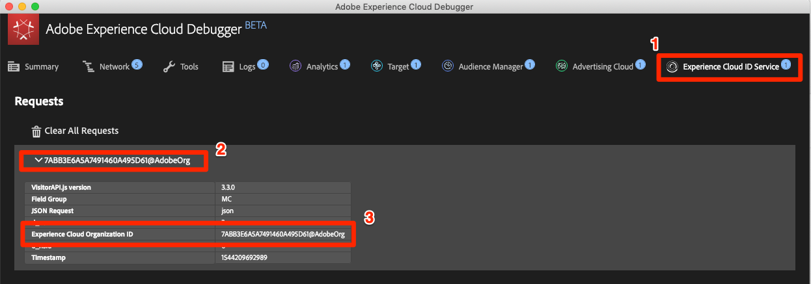
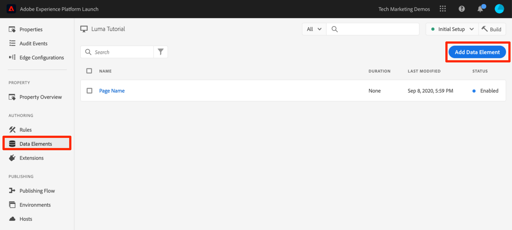
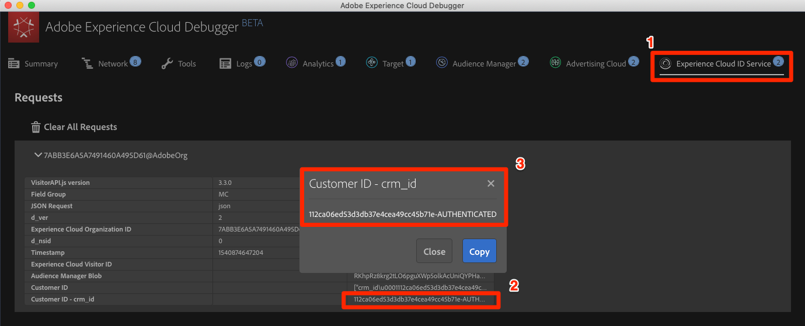

# Adobe Experience Platform ID 서비스 추가

이 단원에서는 [Adobe Experience Platform ID 서비스 확장](https://experienceleague.adobe.com/docs/experience-platform/tags/extensions/adobe/id-service/overview.html)을 구현하고 고객 ID를 전송하는 데 필요한 절차를 안내합니다.

[Adobe Experience Platform Identity 서비스](https://experienceleague.adobe.com/docs/id-service/using/home.html)에서는 솔루션 간 대상 공유와 같은 Experience Cloud 기능을 지원하기 위해 모든 Adobe 솔루션에 공통 방문자 ID를 설정합니다. 또한 고유한 고객 ID를 서비스로 보내어 장치 간 타깃팅 및 CRM(고객 관계 관리) 시스템과의 통합을 가능하게 할 수 있습니다.

>[!NOTE]
>
>Adobe Experience Platform Launch은 데이터 수집 기술군으로 Adobe Experience Platform에 통합되고 있습니다. 이 콘텐츠를 사용하는 동안 알아야 하는 몇 가지 용어 변경 사항이 인터페이스에 롤아웃되었습니다.
>
> * 이제 Platform Launch(Client Side)가 **[[!DNL tags]](https://experienceleague.adobe.com/docs/experience-platform/tags/home.html)**&#x200B;입니다.
> * 이제 Platform Launch Server Side가 **[[!DNL event forwarding]](https://experienceleague.adobe.com/docs/experience-platform/tags/event-forwarding/overview.html)**&#x200B;입니다.
> * 이제 Edge 구성이 **[[!DNL datastreams]](https://experienceleague.adobe.com/docs/experience-platform/edge/fundamentals/datastreams.html)**&#x200B;입니다.

## 학습 목표

이 단원을 마치면 다음을 수행할 수 있습니다.

* ID 서비스 확장 추가
* 고객 ID를 수집하기 위한 데이터 요소 만들기
* 고객 ID 설정 작업을 사용하여 고객 ID를 Adobe에 보내는 규칙 만들기
* 규칙 순서 지정 기능을 사용하여 동일한 이벤트에서 실행되는 규칙 순서 지정

## 전제 조건

[태그 구성](create-a-property.md) 섹션의 학습 내용을 이미 완료했어야 합니다.

## ID 서비스 확장 추가

추가할 첫 번째 확장이므로 확장에 대한 간단한 개요를 소개합니다. 확장은 태그의 핵심 기능 중 하나입니다. 확장은 Adobe, Adobe 파트너 또는 사용자가 자신의 웹 사이트에 배포할 수 있는 태그에 대한 새로운 옵션과 무제한 옵션을 추가하는 Adobe 고객이 빌드한 통합입니다. 태그를 운영 체제라고 생각하면 확장은 사용자가 설치하는 앱으로, 태그가 필요한 작업을 수행할 수 있습니다.

**ID 서비스 확장을 추가하려면**

1. 왼쪽 탐색에서 **[!UICONTROL 확장]**&#x200B;을 클릭합니다

1. 확장 카탈로그 페이지로 이동하려면 **[!UICONTROL 카탈로그]**&#x200B;를 클릭하십시오.

1. 카탈로그에서 사용할 수 있는 다양한 확장을 확인합니다.

1. 맨 위의 필터에서 &quot;id&quot;를 입력하여 카탈로그를 필터링합니다.

1. Adobe Experience Platform Identity 서비스 카드에서 **[!UICONTROL 설치]**&#x200B;를 클릭합니다

   

1. Experience Cloud 조직 ID가 자동으로 검색됩니다.

1. 모든 기본 설정을 그대로 두고 **[!UICONTROL 라이브러리 및 빌드에 저장]**&#x200B;을 클릭합니다.

   

>[!NOTE]
>
>ID 서비스 확장의 각 버전은 확장 설명에 나와 있는 VisitorAPI.js의 특정 버전과 함께 제공됩니다. ID 서비스 확장을 업데이트하여 VisitorAPI.js 버전을 업데이트합니다.

### 확장 유효성 검사

ID 서비스 확장은 규칙 작업을 사용하지 않고도 요청을 수행하는 몇 가지 태그 확장 중 하나입니다. 확장은 웹 사이트에 대한 첫 번째 방문 중 첫 페이지 로드 시 ID 서비스에 자동으로 요청을 수행합니다. 요청한 ID는 &quot;AMCV_&quot;로 시작하는 자사 쿠키에 저장됩니다.

**ID 서비스 확장의 유효성을 검사하려면**

1. [Luma 사이트](https://luma.enablementadobe.com/content/luma/us/en.html)를 엽니다.

1. [이전 단원](switch-environments.md)에 설명된 대로 Debugger가 태그 속성을 *사용자* 개발 환경에 매핑하는지 확인합니다.

1. 디버거의 요약 탭에서 태그 섹션은 Adobe Experience Platform ID 서비스 확장이 구현되었음을 나타내야 합니다.

1. 또한 요약 탭에서 ID 서비스 섹션은 데이터 수집 인터페이스의 확장 구성 화면에 표시된 것과 동일한 조직 ID로 채워집니다.

   

1. 방문자 ID 검색에 대한 초기 요청은 디버거의 ID 서비스 탭에 나타날 수 있습니다. 이미 요청했을 수도 있으며, 표시되지 않더라도 걱정하지 마십시오:
   

1. 방문자 ID 가져오기에 대한 초기 요청 이후 ID는 `AMCV_`로 시작되는 쿠키에 저장됩니다. 다음을 수행하면 쿠키가 설정되었는지 확인할 수 있습니다.
   1. 브라우저의 개발자 도구를 엽니다
   1. `Application` 탭으로 이동합니다.
   1. 왼쪽의 `Cookies`를 확장합니다.
   1. 도메인 `https://luma.enablementadobe.com`을 클릭합니다.
   1. 오른쪽에서 AMCV_ 쿠키를 찾습니다. 하드코딩된 태그 속성을 사용하여 Luma 사이트를 로드하고 자체 사이트에 매핑했으므로 여러 개가 표시될 수 있습니다.
      

됐습니다. 첫 번째 확장을 추가했습니다. ID 서비스의 구성 옵션에 대한 자세한 내용은 [설명서](https://experienceleague.adobe.com/docs/id-service/using/id-service-api/configurations/function-vars.html)를 참조하십시오.

## 고객 ID 보내기

다음으로, [고객 ID](https://experienceleague.adobe.com/docs/id-service/using/reference/authenticated-state.html)를 ID 서비스로 보냅니다. 이렇게 하면 Experience Cloud와 [CRM을 통합](https://experienceleague.adobe.com/docs/core-services/interface/customer-attributes/attributes.html?lang=ko-KR)하고 장치 간에 방문자를 추적할 수 있습니다.

이전 단원 [데이터 요소, 규칙 및 라이브러리 추가](add-data-elements-rules.md)에서는 데이터 요소를 만들어 규칙에 사용했습니다. 이제 방문자가 인증되면 동일한 기술을 사용하여 고객 ID를 보냅니다.

### 고객 ID에 대한 데이터 요소 만들기

먼저 두 개의 데이터 요소를 만듭니다.

1. `Authentication State`—방문자가 로그인했는지 여부를 캡처합니다.
1. `Email (Hashed)`—데이터 계층에서 이메일 주소(고객 ID로 사용됨)의 해시된 버전을 캡처합니다.

**인증 상태에 대한 데이터 요소를 만들려면**

1. 왼쪽 탐색에서 **[!UICONTROL 데이터 요소]**&#x200B;를 클릭합니다
1. **[!UICONTROL 데이터 요소 추가]** 단추를 클릭합니다.

   

1. 데이터 요소에 이름을 지정합니다 `Authentication State`
1. **[!UICONTROL 데이터 요소 형식]**&#x200B;에 대해 **[!UICONTROL 사용자 지정 코드]**&#x200B;를 선택하십시오.
1. **[!UICONTROL 편집기 열기]** 단추를 클릭합니다.

   

1. [!UICONTROL Edit Code] 창에서 다음 코드를 사용하여 Luma 사이트의 데이터 레이어에 있는 속성을 기반으로 &quot;로그인됨&quot; 또는 &quot;로그아웃됨&quot; 값을 반환합니다.

   ```javascript
   if (digitalData.user[0].profile[0].attributes.loggedIn)
       return "logged in"
   else
       return "logged out"
   ```

1. 사용자 지정 코드를 저장하려면 **[!UICONTROL 저장]**&#x200B;을 클릭하세요.

   

1. 다른 모든 설정은 기본값으로 둡니다.
1. 데이터 요소를 저장하고 데이터 요소 페이지로 돌아가려면 **[!UICONTROL 라이브러리에 저장]**&#x200B;을 클릭합니다. 모든 변경 작업을 완료하고 유효성을 검사할 준비가 될 때까지 &quot;빌드&quot;를 수행하지 않아도 됩니다.

   

사용자의 인증 상태를 알면, 페이지에 ID 서비스로 보낼 고객 ID가 언제 있어야 하는지 알 수 있습니다. 다음 단계는 고객 ID 자체에 대한 데이터 요소를 만드는 것입니다. Luma 데모 사이트에서는 방문자 이메일 주소의 해시된 버전을 사용합니다.

**해시된 이메일에 대한 데이터 요소를 추가하려면**

1. **[!UICONTROL 데이터 요소 추가]** 단추를 클릭합니다.

   

1. 데이터 요소에 이름을 지정합니다 `Email (Hashed)`
1. **[!UICONTROL 데이터 요소 유형]**&#x200B;에 대해 **[!UICONTROL JavaScript 변수]**&#x200B;를 선택합니다.
1. **[!UICONTROL JavaScript 변수 이름]**(으)로 Luma 사이트의 데이터 레이어에 있는 변수에 다음 포인터를 사용합니다. `digitalData.user.0.profile.0.attributes.username`
1. 다른 모든 설정은 기본값으로 둡니다.
1. 데이터 요소를 저장하려면 **[!UICONTROL 라이브러리에 저장]**&#x200B;을 클릭하세요.

   

### 고객 ID를 전송하는 규칙 추가

Adobe Experience Platform ID 서비스는 &quot;고객 ID 설정&quot;이라는 작업을 사용하여 규칙의 고객 ID를 전달합니다. 방문자가 인증되면 이제 이 작업을 트리거하는 규칙을 만듭니다.

**고객 ID를 전송하는 규칙을 추가하려면**

1. 왼쪽 탐색에서 **[!UICONTROL 규칙]**&#x200B;을 클릭합니다
1. 규칙 빌더를 열려면 **[!UICONTROL 규칙 추가]**&#x200B;를 클릭하십시오.

   

1. 규칙 이름을 지정합니다 `All Pages - Library Loaded - Authenticated - 10`

   >[!TIP]
   >
   >이러한 명명 규칙은 사용자가 인증되고 순서가 &quot;10&quot;일 때 모든 페이지의 맨 위에서 이 규칙을 실행함을 나타냅니다. 작업에 트리거된 솔루션에 대해 이름을 지정하는 대신 이와 같은 이름 지정 규칙을 사용하여 구현에 필요한 전체 규칙 수를 최소화할 수 있습니다.

1. **[!UICONTROL 이벤트]**&#x200B;에서 **[!UICONTROL 추가]**&#x200B;를 클릭합니다.

   

   1. **[!UICONTROL 이벤트 유형]**&#x200B;에 대해 **[!UICONTROL 로드된 라이브러리(페이지 상단)]**&#x200B;를 선택합니다.
   1. **[!UICONTROL 고급 옵션]** 섹션을 확장하고 **[!UICONTROL 주문]**&#x200B;에 대해 `10`을(를) 입력하십시오. 이 순서는 동일한 이벤트에 의해 트리거되는 규칙의 순서를 제어합니다. 순서가 낮은 규칙이 순서가 높은 규칙보다 먼저 실행됩니다. 이 경우 Target 요청을 실행하기 전에 고객 ID를 설정해야 합니다. 이 작업은 순서가 `50`인 규칙을 사용하여 다음 단원에서 수행합니다.
   1. 규칙 빌더로 돌아가려면 **[!UICONTROL 변경 내용 유지]** 단추를 클릭하십시오.

   

1. **[!UICONTROL 조건]**&#x200B;에서 **[!UICONTROL 추가]**&#x200B;를 클릭합니다.

   

   1. **[!UICONTROL 조건 유형]**&#x200B;에 대해 **[!UICONTROL 값 비교]**&#x200B;를 선택합니다.
   1.  아이콘을 클릭하여 데이터 요소 모달을 엽니다.

      

   1. 데이터 요소 모달에서 **[!UICONTROL 인증 상태]**&#x200B;를 클릭한 다음 **[!UICONTROL 선택]**&#x200B;을 클릭합니다

      

1. `Equals`가 연산자인지 확인합니다.
1. 텍스트 필드에 &quot;logged in&quot;을 입력하면 데이터 요소 &quot;Authentication State&quot;의 값이 &quot;logged in&quot;일 때마다 규칙이 실행됩니다.

1. **[!UICONTROL 변경 내용 유지]** 클릭

   

1. **[!UICONTROL 작업]**&#x200B;에서 **[!UICONTROL 추가]**&#x200B;를 클릭합니다.

   

   1. **[!UICONTROL 확장]**&#x200B;에 대해 **[!UICONTROL Experience Cloud ID 서비스]**&#x200B;를 선택합니다.
   1. **[!UICONTROL Action Type]**&#x200B;에 대해 **[!UICONTROL 고객 ID 설정]**&#x200B;을(를) 선택합니다.
   1. **[!UICONTROL 통합 코드]**&#x200B;에 대해 `crm_id`을(를) 입력하십시오.
   1. **[!UICONTROL Value]**&#x200B;에 대해 데이터 요소 선택기 모달을 열고 `Email (Hashed)`을(를) 선택합니다.
   1. **[!UICONTROL 인증 상태]**&#x200B;에 대해 **[!UICONTROL 인증됨]**&#x200B;을(를) 선택합니다.
   1. 작업을 저장하고 규칙 빌더로 돌아가려면 **[!UICONTROL 변경 내용 유지]** 단추를 클릭하십시오.

      

1. 규칙을 저장하려면 **[!UICONTROL 라이브러리 및 빌드에 저장]** 단추를 클릭하십시오.

   

이제 방문자가 인증되었을 때 변수 `crm_id`로서 고객 ID를 전송하는 규칙을 만들었습니다. Order를 `10`으로 지정했으므로, 이 규칙은 기본 Order 값 `50`을 사용하는 [데이터 요소, 규칙 및 라이브러리 추가](add-data-elements-rules.md) 단원에서 만든 `All Pages - Library Loaded` 규칙 전에 실행됩니다.

### 고객 ID의 유효성 검사

작업의 유효성을 검사하기 위해 Luma 사이트에 로그인하여 새 규칙의 동작을 확인합니다.

**Luma 사이트에 로그인하려면**

1. [Luma 사이트](https://luma.enablementadobe.com/content/luma/us/en.html)를 엽니다.

1. [이전 단원](switch-environments.md)에 설명된 대로 Debugger가 태그 속성을 *사용자* 개발 환경에 매핑하는지 확인합니다.

   

1. Luma 사이트의 오른쪽 위 모서리에 있는 **[!UICONTROL LOGIN]** 링크를 클릭합니다.

   

1. 사용자 이름으로 `test@test.com`을 입력합니다.
1. 암호로 `test`를 입력합니다.
1. **[!UICONTROL 로그인]** 단추를 클릭합니다.

   

1. 홈 페이지로 돌아갑니다

이제, 고객 ID가 디버거 확장을 사용하여 서비스에 전송되었는지 확인합니다.

**ID 서비스가 고객 ID를 전달하는지 확인하려면**

1. Luma 사이트가 있는 탭에 초점이 맞춰졌는지 확인합니다.
1. 디버거에서 Adobe Experience Platform ID 서비스 탭으로 이동합니다.
1. 조직 ID를 확장합니다.
1. `Customer ID - crm_id` 값이 있는 셀을 클릭합니다.
1. 모달에서 고객 ID 값과 `AUTHENTICATED` 상태가 반영된 것을 확인합니다.

   

1. Luma 페이지의 소스 코드를 보고 사용자 이름 속성을 검토하여 해시된 이메일 값을 확인할 수 있습니다. 이 값은 디버거에 표시되는 값과 일치해야 합니다.

   

### 추가적인 유효성 검사 팁

태그에는 풍부한 콘솔 로깅 기능도 있습니다. 이 기능들을 켜려면 디버거의 **[!UICONTROL 도구]** 탭으로 이동하여 **[!UICONTROL 태그 콘솔 로깅]** 토글을 켜십시오.


이렇게 하면 브라우저 콘솔과 디버거의 로그 탭에서 콘솔 로깅이 모두 켜집니다. 지금까지 만든 모든 규칙에 대한 기록이 표시됩니다! 새 로그 항목이 목록 맨 위에 추가되므로, &quot;All Pages - Library Loaded - Authenticated - 10&quot; 규칙은 &quot;All Pages - Library Loaded&quot; 규칙보다 먼저 실행되고 디버거의 Console Logging에서 아래에 표시됩니다.


[다음 &quot;Adobe Target 추가&quot; >](target.md)
