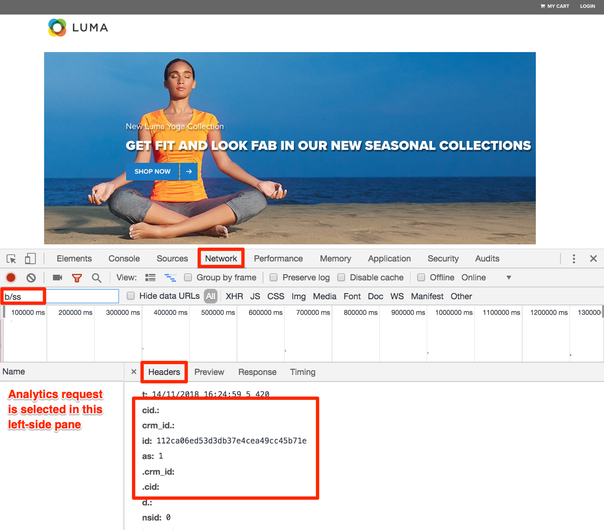

# Experience Cloud 통합

이 단원에서는 방금 구현한 솔루션 간의 주요 통합을 살펴봅니다. 좋은 소식은 이전 단원을 완료함으로써 통합의 코드 측면을 이미 구현했다는 것입니다. 이 단원에서는 읽기 및 유효성 검사 외에 추가 작업을 수행하지 않아도 됩니다.

## 학습 목표

이 단원을 마치면 다음을 수행할 수 있습니다.

1. 대상 공유, 타겟 분석(A4T) 및 사용자 특성 통합에 대한 기본 사용 사례 설명
1. 이러한 통합의 기본 클라이언트측 구현 측면에 대한 유효성 검사

## 전제 조건

이 단원의 지침을 따르려면 먼저 이 자습서의 모든 이전 단원을 완료해야 합니다.

>[!NOTE]
>
>이러한 통합을 완전히 사용하는 데 필요하고 이 자습서의 범위를 벗어난 많은 사용자 권한 요구 사항, 계정 구성 및 프로비저닝 단계가 있습니다. 현재 Experience Cloud 구현에서 이러한 통합을 이미 사용하고 있지 않다면 다음 사항을 고려해야 합니다.
>
>* [코어 서비스 통합](https://experienceleague.adobe.com/docs/core-services/interface/about-core-services/core-services.html?lang=ko-KR)의 전체 요구 사항 검토
>* [Analytics for Target 통합](https://experienceleague.adobe.com/docs/target/using/integrate/a4t/before-implement.html)을 위한 전체 요구 사항 검토
>* Experience Cloud 조직의 관리자로 하여금 [이러한 통합의 프로비저닝을 요청](https://www.adobe.com/go/audiences)하게 함

## 대상자

[대상](https://experienceleague.adobe.com/docs/core-services/interface/audiences/audience-library.html)은 사람 핵심 서비스의 일부이며 솔루션 간에 대상을 공유할 수 있도록 해줍니다. 예를 들어 Audience Manager에서 대상을 만들고 이 대상을 사용하여 Target으로 개인화된 컨텐츠를 전달할 수 있습니다.

A4T 구현(이미 수행함)을 위한 주요 요구 사항은 다음과 같습니다.

1. Adobe Experience Platform ID 서비스 구현
1. Audience Manager 구현
1. Target 및 Analytics처럼 대상을 받거나 만들게 할 다른 솔루션 구현

### 대상 통합의 유효성 검사

대상 통합의 유효성을 검사하는 가장 좋은 방법은 실제로 대상을 만들고, 다른 솔루션에 공유한 다음, 다른 솔루션에서 완전히 사용하는 것입니다(예: AAM 세그먼트 자격이 있는 방문자가 해당 세그먼트를 타깃팅된 Target 활동에 대한 자격이 있는지 확인). 그러나 이 작업은 이 자습서의 범위를 벗어납니다.

이러한 유효성 검사 절차는 클라이언트측 구현에 표시되는 중요한 부분, 즉 방문자 ID에 중점을 둡니다.

1. [Luma 사이트](https://luma.enablementadobe.com/content/luma/us/en.html)를 엽니다.

1. [이전 단원](switch-environments.md)에 설명된 대로 Debugger가 태그 속성을 *사용자* 개발 환경에 매핑하는지 확인합니다.

   

1. 디버거의 네트워크 탭으로 이동합니다.

1. 정리하려면 **[!UICONTROL 모든 요청 지우기]**&#x200B;를 클릭하십시오.

1. Luma 페이지를 다시 로드하여 디버거에서 Target 및 Analytics 요청이 모두 표시되는지 확인합니다.

1. Luma 페이지를 다시 로드합니다.

1. 디버거의 네트워크 탭에 Target에 대한 요청 2개와 Analytics에 대한 요청 2개, 이렇게 모두 4개의 요청이 표시됩니다.

1. 레이블 &quot;Experience Cloud 방문자 ID&quot;이 지정된 행을 살펴봅니다. 솔루션별로 모든 요청에 있는 ID는 항상 동일해야 합니다.

   

1. 이 ID는 방문자별로 고유하며, 동료에게 이러한 단계를 반복하도록 요청하여 확인할 수 있습니다.

## Analytics for Target (A4T)

[A4T(타겟 분석)](https://experienceleague.adobe.com/docs/target/using/integrate/a4t/a4t.html) 통합을 사용하면 Analytics 데이터를 Target의 보고 지표의 소스로 활용할 수 있습니다.

A4T 구현(이미 수행함)을 위한 주요 요구 사항은 다음과 같습니다.

1. Adobe Experience Platform ID 서비스 구현
1. Analytics 페이지 보기 비콘 전에 Target 페이지 로드 요청 실행

A4T는 Target에서 Analytics로의 서버측 요청을 Analytics 페이지 보기 비콘과 함께 결합하는 방식으로 작동하며, 이 비콘은 &quot;히트 스티칭&quot;이라고 합니다. 히트 스티칭을 사용하려면 활동을 전달하는(또는 Target 기반 목표 지표를 늘리는) Target 요청에 Analytics 페이지 보기 비콘의 매개 변수와 일치하는 매개 변수가 있어야 합니다. 이 매개 변수를 SDID(Supplemental Data ID)라고 합니다.

### A4T 구현의 유효성 검사

A4T 통합의 유효성을 검사하는 가장 좋은 방법은 A4T를 사용하여 Target 활동을 실제로 만들고 보고 데이터의 유효성을 검사하는 것입니다. 하지만 이것은 이 자습서의 범위를 벗어납니다. 이 자습서에서는 보조 데이터 ID가 솔루션 호출 간에 일치하는지 확인하는 방법을 보여줍니다.

**SDID의 유효성을 검사하려면**

1. [Luma 사이트](https://luma.enablementadobe.com/content/luma/us/en.html)를 엽니다.

1. [이전 단원](switch-environments.md)에 설명된 대로 Debugger가 태그 속성을 *사용자* 개발 환경에 매핑하는지 확인합니다.

   

1. 디버거의 네트워크 탭으로 이동합니다.

1. 정리하려면 **[!UICONTROL 모든 요청 지우기]**&#x200B;를 클릭하십시오.

1. Luma 페이지를 다시 로드하여 디버거에서 Target 및 Analytics 요청이 모두 표시되는지 확인합니다.

1. Luma 페이지를 다시 로드합니다.

1. 디버거의 네트워크 탭에 Target에 대한 요청 2개와 Analytics에 대한 요청 2개, 이렇게 모두 4개의 요청이 표시됩니다.

1. 보조 데이터 ID 행을 찾습니다. 첫 번째 페이지 로드 시 이 ID는 Target과 Analytics 간에 일치해야 합니다. 두 번째 페이지 로드 시에도 이 ID가 일치해야 하지만, 첫 번째 페이지 로드 시와 다릅니다.

   

A4T 활동의 일부인 페이지 로드 범위(단일 페이지 앱은 포함되지 않음)에서 Target 요청을 추가로 수행하는 경우, 초기 Target 및 Analytics 요청의 SDID가 계속 동일하도록 고유한 이름(target-global-mbox 아님)을 제공하는 것이 좋습니다.

## 사용자 특성

[사용자 특성](https://experienceleague.adobe.com/docs/core-services/interface/customer-attributes/attributes.html?lang=ko-KR)은 CRM(고객 관계 관리) 데이터베이스에서 데이터를 업로드하고 이를 Adobe Analytics 및 Adobe Target에서 활용할 수 있는 사람 핵심 서비스의 일부입니다.

사용자 특성 구현(이미 수행함)을 위한 주요 요구 사항은 다음과 같습니다.

1. Adobe Experience Platform ID 서비스 구현
1. Target 및 Analytics에서 해당 요청을 실행( 태그에서 규칙 순서 지정 기능을 사용하여 수행함)하는 ID 서비스를 통해 *이전*&#x200B;에 고객 ID를 설정합니다.

### 사용자 특성 구현의 유효성 검사

고객 ID가 이전 단원에서 ID 서비스와 Target 모두에 전달되었음을 이미 확인했습니다. Analytics 히트에서도 고객 ID의 유효성을 검사할 수 있습니다.
현재 고객 ID는 Experience Cloud Debugger에 표시되지 않는 몇 가지 매개 변수 중 하나이지만, 브라우저의 JavaScript 콘솔을 사용하여 보게 될 것입니다.

1. Luma 사이트를 엽니다.
1. 브라우저의 개발자 도구를 엽니다
1. 네트워크 탭으로 이동합니다.
1. 표시되는 내용을 Adobe Analytics 요청으로 제한하는 `b/ss`를 필터 필드에 입력합니다.

   

1. 사이트의 오른쪽 위 모서리에 있는 **[!UICONTROL LOGIN]** 링크를 클릭합니다.

   

1. 사용자 이름으로 `test@adobe.com`을 입력합니다.
1. 암호로 `test`를 입력합니다.
1. **[!UICONTROL 로그인]** 단추를 클릭합니다.

   

1. 홈 페이지가 표시됩니다. 이에 따라 개발자 도구에서 볼 수 있는 비콘도 트리거됩니다. 계정 정보 페이지가 표시되는 경우 WE.RETAIL 로고를 클릭하여 홈 페이지로 돌아갑니다.
1. 요청을 클릭하고 Headers 탭을 선택합니다.
1. 중첩된 매개 변수가 표시될 때까지 아래로 스크롤합니다.
   1. cid - 요청의 고객 ID 부분에 대한 표준 구분 기호입니다.
   1. crm_id - ID 서비스 단원에서 지정한 사용자 지정 통합 코드입니다.
   1. id - `Email (Hashed)` 데이터 요소에서 가져오는 고객 ID 값
   1. as - 인증 상태. &quot;1&quot;은 로그인되었음을 의미합니다.

   

[다음 &quot;속성 Publish&quot; >](publish.md)
