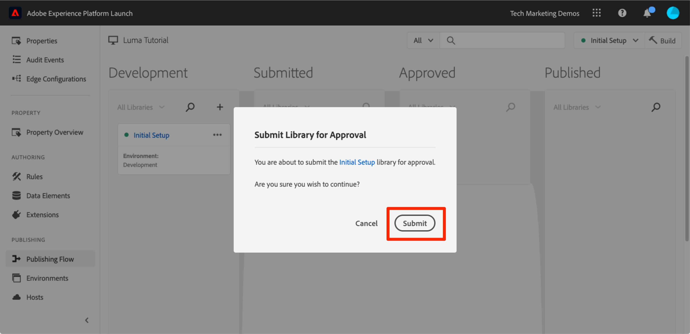
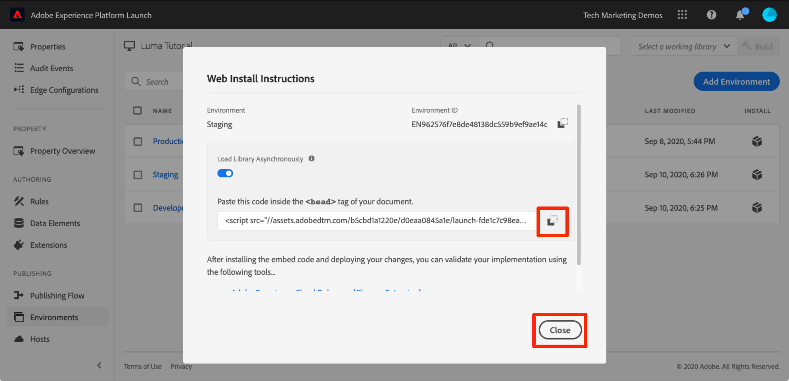
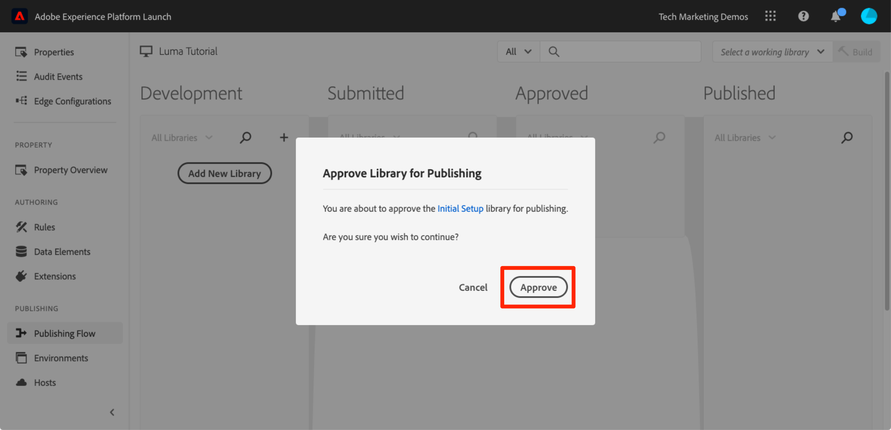

# 태그 속성 게시

이제 개발 환경에서 Adobe Experience Cloud의 몇 가지 주요 솔루션을 구현했으므로 게시 작업 과정을 학습할 차례입니다.

>[!NOTE]
>
>Adobe Experience Platform Launch은 데이터 수집 기술군으로 Adobe Experience Platform에 통합되고 있습니다. 이 콘텐츠를 사용하는 동안 알아야 하는 몇 가지 용어 변경 사항이 인터페이스에 롤아웃되었습니다.
>
> * 이제 platform launch(클라이언트측)이 **[[!DNL tags]](https://experienceleague.adobe.com/docs/experience-platform/tags/home.html)**
> * 이제 platform launch 서버측이 **[[!DNL event forwarding]](https://experienceleague.adobe.com/docs/experience-platform/tags/event-forwarding/overview.html)**
> * 이제 Edge 구성이 **[[!DNL datastreams]](https://experienceleague.adobe.com/docs/experience-platform/edge/fundamentals/datastreams.html)**

## 학습 목표

이 단원을 마치면 다음을 수행할 수 있습니다.

1. 스테이징 환경에 개발 라이브러리 게시
1. 디버거를 사용하여 프로덕션 웹 사이트에 스테이징 라이브러리 매핑
1. 프로덕션 환경에 스테이징 라이브러리 게시

## 스테이징에 게시

이제 개발 환경에서 라이브러리를 만들고 유효성을 검사했으므로 이것을 스테이징에 게시할 차례입니다.

1. 로 이동 **[!UICONTROL 게시 플로우]** 페이지

1. 라이브러리 옆의 드롭다운을 열고 **[!UICONTROL Submit for Approval]**&#x200B;을 선택합니다.

   

1. 대화 상자에서 **[!UICONTROL Submit]** 단추를 클릭합니다.

   

1. 이제 라이브러리가 [!UICONTROL Submitted] 열에 빌드되지 않은 상태로 나타납니다.

1. 드롭다운을 열고 **[!UICONTROL Build for Staging]**&#x200B;를 선택합니다.

   

1. 녹색 점이 있는 아이콘이 나타나면 스테이징 환경에서 라이브러리를 미리 볼 수 있습니다.

실제 시나리오에서는 프로세스의 다음 단계에서 QA 팀이 스테이징 라이브러리의 변경 사항에 대한 유효성을 검사하도록 해야 합니다. QA 팀은 디버거를 사용하여 이 작업을 수행할 수 있습니다.

**스테이징 라이브러리의 변경 사항에 대한 유효성을 검사하려면**

1. 태그 속성에서 [!UICONTROL 환경] 페이지

1. [!UICONTROL Staging] 행에서 Install 아이콘 을 클릭하여 모달을 엽니다.

   

1. Copy 아이콘 을 클릭하여 포함 코드를 클립보드에 복사합니다.

1. **[!UICONTROL Close]**&#x200B;를 클릭하여 모달을 닫습니다.

   

1. Chrome 브라우저에서 [Luma 데모 사이트](https://luma.enablementadobe.com/content/luma/us/en.html)를 엽니다.

1. 를 엽니다. [Experience Platform 디버거 확장](https://chromewebstore.google.com/detail/adobe-experience-platform/bfnnokhpnncpkdmbokanobigaccjkpob) 을(를) 클릭하여  아이콘

   

1. Tools 탭으로 이동합니다.

1. 다음에서 **[!UICONTROL Adobe Launch > Launch 포함 코드 바꾸기]** 섹션에 클립보드에 있는 스테이징 포함 코드를 붙여 넣습니다.
1. 켜기 **[!UICONTROL luma.enablementadobe.com에 적용]** 전환

1. 디스크 아이콘을 클릭하여 저장합니다.

   

1. 디버거의 Summary 탭을 다시 로드하고 확인합니다. 이제 Launch 섹션 아래에 스테이징 속성이 구현되었다고 표시되고 속성 이름(즉, &quot;태그 자습서&quot; 또는 지정한 모든 속성 이름)이 표시됩니다.

   

실제로 QA 팀이 스테이징 환경에서 변경 사항을 검토하여 로그오프했으면 프로덕션에 게시할 차례입니다.

## 프로덕션에 게시

1. [!UICONTROL Publishing] 페이지로 이동합니다.

1. 드롭다운에서 **[!UICONTROL Approve for Publishing]**&#x200B;을 클릭합니다.

   

1. 대화 상자에서 **[!UICONTROL Approve]** 단추를 클릭합니다.

   

1. 이제 라이브러리가 [!UICONTROL Approved] 열에 빌드되지 않은 상태(노란색 점)로 나타납니다.

1. 드롭다운을 열고 **[!UICONTROL Build and Publish to Production]**&#x200B;을 선택합니다.

   

1. 대화 상자에서 **[!UICONTROL Publish]**&#x200B;를 클릭합니다.

   

1. 이제 라이브러리가 [!UICONTROL Published] 열에 나타납니다.

   

됐습니다. 자습서를 완료하고 첫 번째 속성을 태그에 게시했습니다!
