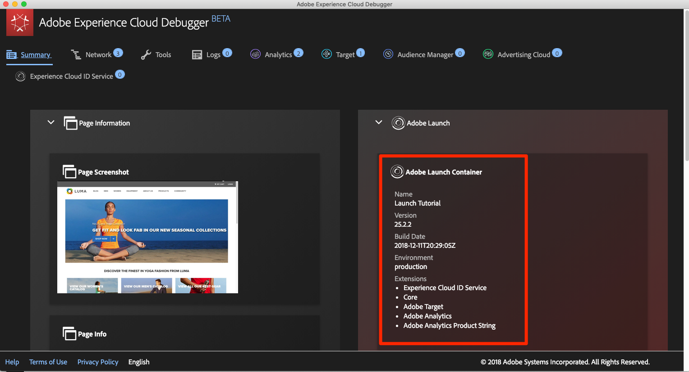

# Experience Cloud 디버거를 사용하여 태그 환경 전환

이 단원에서는 [Adobe Experience Platform Debugger 확장](https://chromewebstore.google.com/detail/adobe-experience-platform/bfnnokhpnncpkdmbokanobigaccjkpob)을 사용하여 [Luma 데모 사이트](https://luma.enablementadobe.com/content/luma/us/en.html)에서 하드코딩된 태그 속성을 자신의 속성으로 바꿉니다.

>[!WARNING]
>
> 이 자습서와 해당 Luma 웹 사이트 연습은 더 이상 유지 관리되지 않으며 이전 JavaScript 라이브러리를 사용합니다. 현재 모범 사례에 대해 알아보려면 [Web SDK을 사용하여 Adobe Experience Cloud 구현 자습서](https://experienceleague.adobe.com/ko/docs/platform-learn/implement-web-sdk/overview)를 사용하십시오.

이 기법은 환경 전환이라고 하며 나중에 웹 사이트에서 태그를 사용하여 작업할 때 유용합니다. 브라우저에서 프로덕션 웹 사이트를 로드할 수 있지만 *개발* 태그 환경을 사용하면 됩니다. 이렇게 하면 일반 코드 릴리스와 독립적으로 태그 변경 사항을 만들고 확인할 수 있습니다.  결국, 일반 코드 릴리스에서 마케팅 태그 릴리스가 이렇게 분리되는 것은 고객이 태그를 우선 사용하는 주요 이유 중 하나입니다!

## 학습 목표

이 단원을 마치면 다음을 수행할 수 있습니다.

* 디버거를 사용하여 대체 태그 환경 로드
* 디버거를 사용하여 대체 태그 환경을 로드했는지 확인

## 개발 환경의 URL 가져오기

1. 태그 속성에서 `Environments` 페이지를 엽니다.

1. **[!UICONTROL 개발]** 행에서 설치 아이콘 을 클릭하여 모달을 엽니다

1. Copy 아이콘 을 클릭하여 임베드 코드를 클립보드에 복사합니다.

1. 모달을 닫으려면 **[!UICONTROL 닫기]**&#x200B;를 클릭하십시오.

   

## Luma 데모 사이트에서 태그 URL 바꾸기

1. Chrome 브라우저에서 [Luma 데모 사이트](https://luma.enablementadobe.com/content/luma/us/en.html)를 엽니다.

1. [디버거 아이콘](https://chromewebstore.google.com/detail/adobe-experience-platform/bfnnokhpnncpkdmbokanobigaccjkpob) 아이콘을 클릭하여 을 엽니다.

   

1. 현재 구현된 태그 속성이 요약 탭에 표시되는지 확인합니다

   

1. Tools 탭으로 이동합니다.
1. **[!UICONTROL Launch 포함 코드 바꾸기]** 섹션으로 스크롤
1. Luma 사이트가 있는 Chrome 탭이 디버거(이 자습서가 있는 탭이나 데이터 수집 인터페이스가 있는 탭이 아님) 뒤에서 초점이 맞춰져 있는지 확인합니다.  클립보드에 있는 임베드 코드를 입력 필드에 붙여 넣습니다.
1. Luma 사이트의 모든 페이지가 태그 속성에 매핑되도록 &quot;Apply across luma.enablementadobe.com&quot; 기능을 전환합니다.
1. **[!UICONTROL 저장]** 단추 클릭

   

1. Luma 사이트를 다시 로드하고 디버거의 Summary 탭을 확인합니다. 이제 Launch 섹션에서 개발 속성이 사용되고 있는 것이 보여야 합니다. 속성 이름이 사용자 이름과 일치하고 환경에 &quot;개발&quot;이 표시되는지 확인합니다.

   

>[!NOTE]
>
>Luma 사이트로 돌아올 때마다 디버거가 이 구성을 저장하고 태그 포함 코드를 바꿉니다. 이 경우 열려 있는 다른 탭에서 방문하는 다른 사이트에는 영향을 주지 않습니다. 디버거가 포함 코드를 바꾸지 않도록 하려면 디버거의 Tools 탭에서 포함 코드 옆에 있는 **[!UICONTROL Remove]** 단추를 클릭하십시오.

자습서를 계속 진행하면 Luma 사이트를 자신의 태그 속성에 매핑하여 태그 구현의 유효성을 검사하는 이 기술을 사용하게 됩니다. 프로덕션 웹 사이트에서 태그 사용을 시작할 때 이와 동일한 기술을 사용하여 변경 내용의 유효성을 검사할 수 있습니다.

[다음 &quot;Adobe Experience Platform ID 서비스 추가&quot; >](id-service.md)
