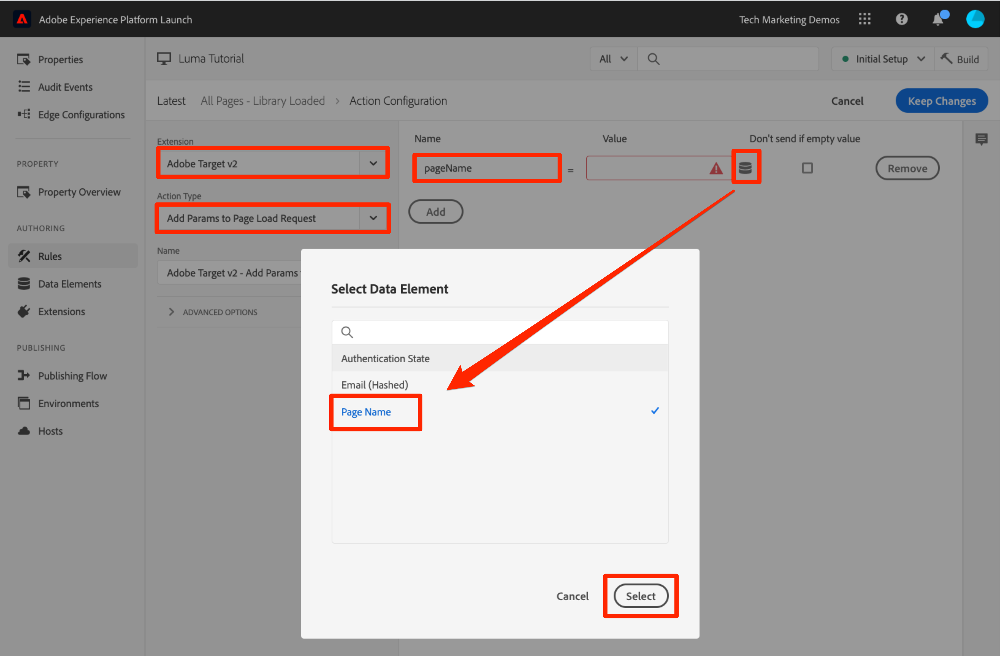
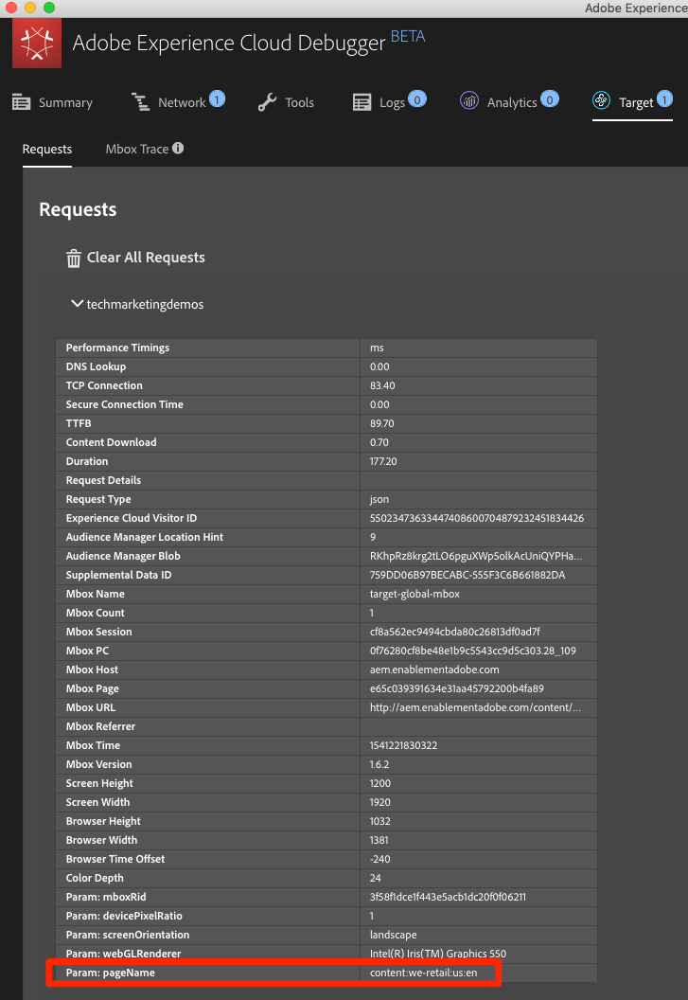
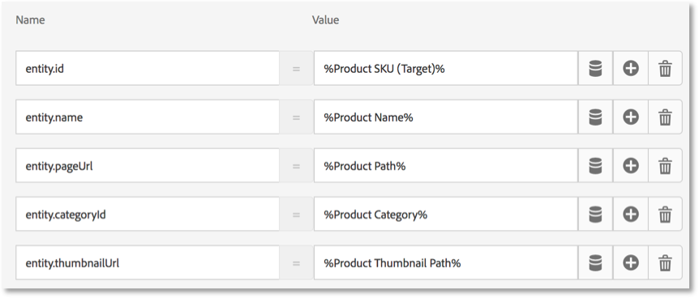
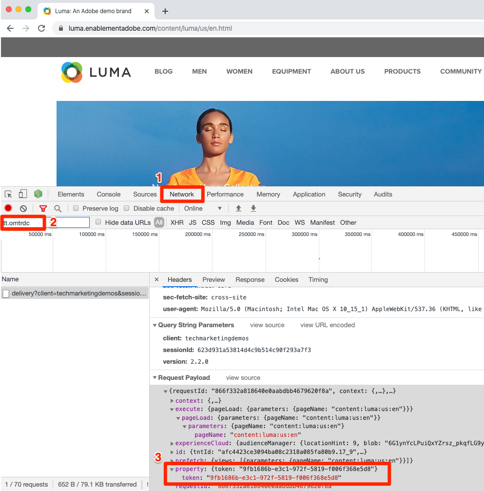

# Adobe Target 추가

이 단원에서는 페이지 로드 요청 및 사용자 지정 매개 변수와 함께 [Adobe Target 확장](https://experienceleague.adobe.com/docs/experience-platform/tags/extensions/adobe/target/overview.html)을 구현합니다.

[Adobe Target](https://experienceleague.adobe.com/docs/target/using/target-home.html)은 고객의 경험을 조정하고 개인화하는 데 필요한 모든 기능을 제공하는 Adobe Experience Cloud 솔루션입니다. 따라서 사용자의 웹 및 모바일 사이트, 앱, 소셜 미디어 및 기타 디지털 채널의 매출을 극대화할 수 있습니다.

>[!NOTE]
>
>Adobe Experience Platform Launch은 데이터 수집 기술군으로 Adobe Experience Platform에 통합되고 있습니다. 이 콘텐츠를 사용하는 동안 알아야 하는 몇 가지 용어 변경 사항이 인터페이스에 롤아웃되었습니다.
>
> * 이제 Platform Launch(Client Side)가 **[!DNL tags]**&#x200B;입니다.
> * 이제 Platform Launch Server Side가 **[!DNL event forwarding]**&#x200B;입니다.
> * 이제 Edge 구성이 **[!DNL datastreams]**&#x200B;입니다.

## 학습 목표

이 단원을 마치면 다음을 수행할 수 있습니다.

* 비동기 태그 포함 코드와 함께 Target을 사용할 때 깜박임을 관리하는 데 사용되는 사전 숨김 코드 조각 추가
* Target v2 확장 추가
* 페이지 로드 요청(이전엔 &quot;글로벌 mbox&quot;라고 함) 실행
* 페이지 로드 요청에 매개 변수 추가
* 프로필 및 엔티티 매개 변수를 페이지 로드 요청에 추가하는 방법을 설명
* 필수 매개 변수와 함께 주문 확인 요청 실행
* 라이브러리 머리글 및 라이브러리 바닥글 코드와 같은 고급 구성을 추가하는 방법을 설명
* Target 구현의 유효성 검사

## 전제 조건

이 섹션의 학습 내용을 완료하려면 먼저 [태그 구성](create-a-property.md) 및 [ID 서비스 추가](id-service.md)의 학습 내용을 완료해야 합니다.

## Target 사전 숨김 코드 조각 추가

시작하기 전에 태그 포함 코드를 약간 업데이트해야 합니다. 태그 포함 코드가 비동기식으로 로드되면 Target 라이브러리가 완전히 로드되고 콘텐츠 교환이 수행되기 전에 페이지에서 렌더링을 완료할 수 있습니다. 이렇게 하면 Target에서 지정한 개인화된 컨텐츠로 대체되기 전에 기본 컨텐츠가 잠깐 나타나는 &quot;깜박임&quot;이라고 하는 것이 나타날 수 있습니다. 이러한 깜박임을 방지하려면 태그의 비동기 포함 코드 바로 앞에 특수 사전 숨김 코드 조각을 하드코딩하는 것이 좋습니다.

이 작업은 이미 Luma 사이트에서 수행되었지만 구현을 이해할 수 있도록 샘플 페이지에서 수행해 보겠습니다. 다음 코드 줄을 복사합니다.

```html
<script>
   //prehiding snippet for Adobe Target with asynchronous tags deployment
   ;(function(win, doc, style, timeout) {
   var STYLE_ID = 'at-body-style';
   function getParent() {
      return doc.getElementsByTagName('head')[0];
   }
   function addStyle(parent, id, def) {
      if (!parent) {
      return;
      }
      var style = doc.createElement('style');
      style.id = id;
      style.innerHTML = def;
      parent.appendChild(style);
   }
   function removeStyle(parent, id) {
      if (!parent) {
      return;
      }
      var style = doc.getElementById(id);
      if (!style) {
      return;
      }
      parent.removeChild(style);
   }
   addStyle(getParent(), STYLE_ID, style);
   setTimeout(function() {
      removeStyle(getParent(), STYLE_ID);
   }, timeout);
   }(window, document, "body {opacity: 0 !important}", 3000));
</script>
```

샘플 페이지를 열고 아래 그림과 같이 태그 포함 코드 바로 앞에 붙여 넣습니다(줄 번호가 다른 경우 걱정하지 마십시오). 이 스크린샷에서는 코드 조각 사전 숨김이 축소되었습니다.


샘플 페이지를 다시 로드합니다. 페이지는 표시되기 전에 3초 동안 숨겨집니다. 이 동작은 일시적이며 Target을 배포하면 사라집니다. 이 사전 숨김 동작은 사용자 지정할 수 있지만 일반적으로 기본 설정에서 맨 왼쪽 위에 있는 코드 조각의 맨 끝에서 다음 두 가지 구성으로 제어됩니다.

* `body {opacity: 0 !important}` - Target이 로드되기 전까지 사전 숨김에 사용할 css 정의를 지정합니다. 기본적으로 전체 본문은 숨겨집니다. 탐색 아래의 모든 컨텐츠를 줄바꿈하는 쉽게 식별할 수 있는 컨테이너 요소와 일관된 DOM 구조가 있으며, 탐색을 테스트하거나 개인화할 필요가 없는 경우 이 설정을 사용하여 해당 컨테이너 요소로 사전 숨김을 제한할 수 있습니다.
* `3000` - 사전 숨김에 대한 시간 초과 설정을 지정합니다. 기본적으로 Target이 3초 후에 로드되지 않으면 페이지가 표시됩니다. 이는 매우 드문 경우입니다.

자세한 내용을 알고 축소되지 않은 사전 숨김 코드 조각을 가져오려면 [비동기 배포를 사용한 Adobe Target 확장](https://experienceleague.adobe.com/docs/experience-platform/tags/extensions/adobe/target/overview.html#adobe-target-extension-with-an-asynchronous-deployment)을 참조하십시오.

## Target 확장 추가

Adobe Target 확장은 최신 웹, at.js에 Target의 JavaScript SDK를 사용하여 클라이언트측 구현을 지원합니다. 여전히 Target의 이전 라이브러리인 mbox.js [을(를) 사용하는 고객은 태그를 사용하려면 at.js 2.x로 업그레이드](https://experienceleague.adobe.com/docs/target/using/implement-target/client-side/mbox-implement/migrate-mbox/target-atjs-implementation.html)해야 합니다.

Target v2 확장은 다음 두 가지 주요 부분으로 구성됩니다.

1. 코어 라이브러리 설정을 관리하는 확장 구성
1. 규칙 작업: 다음을 수행합니다.
   1. Target 로드(at.js 2.x)
   1. 페이지 로드 요청에 매개 변수 추가
   1. 모든 요청에 매개 변수 추가
   1. 페이지 로드 요청 실행

이 첫 번째 연습에서는 확장을 추가하고 구성을 살펴보십시오. 이 작업은 나중에 연습할 때 사용하게 됩니다.

**확장을 추가하려면**

1. **[!UICONTROL 확장 > 카탈로그]**(으)로 이동
1. 필터에 `target`을 입력하여 Adobe Target 확장을 신속하게 찾습니다. Adobe Target과 Adobe Target v2, 이렇게 두 개의 확장이 있습니다. 이 자습서에서는 기존 웹 사이트와 단일 페이지 애플리케이션(SPA) 모두에 적합한 최신 버전의 at.js(현재 2.x)를 사용하는 v2 버전의 확장을 사용합니다.
1. **[!UICONTROL 설치]** 클릭

   

1. 확장을 추가하면 아래 그림과 같이 Target 인터페이스에서 많은 설정을 가져오지만 모든 at.js 설정을 가져오지는 않습니다. 가져오지 않는 한 가지 설정은 시간 초과(확장을 추가한 후 항상 3000ms가 됨)입니다. 자습서에서 기본 설정을 그대로 둡니다. 왼쪽에는 확장의 최신 버전과 함께 제공되는 at.js 버전이 표시됩니다.

1. **[!UICONTROL 라이브러리에 저장]** 클릭

   

현재는 Target이 실제로 아무것도 수행하지 않으므로 확인할 사항이 없습니다.

>[!NOTE]
>
>Target 확장의 각 버전은 확장 설명에 나와 있는 at.js의 특정 버전과 함께 제공됩니다. Target 확장을 업데이트하여 at.js 버전을 업데이트합니다.

## Target 로드 및 페이지 로드 요청 실행

마케터는 Target을 사용하여 컨텐츠를 테스트하고 타깃팅할 때 페이지에서 방문자 경험을 제어합니다. 페이지 표시에서의 이 중요한 역할로 인해 페이지 가시성에 미치는 영향을 최소화하려면 가능한 한 빨리 Target을 로드해야 합니다. 이 섹션에서는 Target JavaScript 라이브러리(at.js)를 로드하고 페이지 로드 요청(이전 버전의 at.js에서는 &quot;글로벌 mbox&quot;라고 함)을 실행합니다.

[데이터 요소, 규칙 및 라이브러리 추가](add-data-elements-rules.md) 단원에서 만든 `All Pages - Library Loaded` 규칙은 페이지 로드 시 가능한 한 빨리 트리거되므로 이 규칙을 사용하여 Target을 구현할 수 있습니다.

**Target을 로드하려면**

1. 왼쪽 탐색에서 **[!UICONTROL 규칙]**(으)로 이동한 다음 `All Pages - Library Loaded`을(를) 클릭하여 규칙 편집기를 엽니다

   

1. Actions 아래에 있는 을 클릭하여 새 작업을 추가합니다.

   

1. **[!UICONTROL 확장 > Adobe Target v2]** 선택

1. **[!UICONTROL 작업 유형 > 대상 로드]** 선택

1. **[!UICONTROL 변경 내용 유지]** 클릭

   

`Load Target` 작업이 추가되면 at.js가 페이지에 로드됩니다. 그러나 Target 요청은 `Fire Page Load Request` 작업을 추가하기 전까지 실행되지 않습니다.

**페이지 로드 요청을 실행하려면**

1. Actions 아래에 있는 을 다시 클릭하여 다른 작업을 추가합니다.

   

1. **[!UICONTROL 확장 > Adobe Target v2]** 선택

1. **[!UICONTROL 작업 유형 > 페이지 로드 요청 실행]**&#x200B;을 선택합니다.

1. 사전 숨김에 사용할 페이지 및 CSS 선택기를 숨길지 여부와 관련된 페이지 로드 요청에 사용할 수 있는 구성이 몇 가지 있습니다. 이러한 설정은 페이지에서 하드코딩된 사전 숨김 코드 조각과 함께 작동합니다. 기본 설정을 그대로 둡니다.

1. **[!UICONTROL 변경 내용 유지]** 클릭

   

1. 새 작업은 `Load Target` 작업 다음에 차례로 추가되고 작업들은 이 순서로 실행됩니다. 작업을 드래그 앤 드롭하여 순서를 변경할 수 있지만 이 시나리오에서는 `Fire Page Load Request` 전에 `Load Target`이 와야 합니다.

1. **[!UICONTROL 라이브러리 및 빌드에 저장]**&#x200B;을 클릭합니다.

   

### 페이지 로드 요청의 유효성 확인

Target v2 확장을 추가하고 `Load Target` 및 `Fire Page Load Request` 작업을 실행했으므로 태그 속성이 사용되는 모든 페이지에서 페이지 로드 요청이 수행되어야 합니다.

**Target 로드 및 페이지 로드 요청 실행 작업의 유효성을 검사하려면**

1. 샘플 페이지를 다시 로드합니다. 페이지가 표시되기 전에 지연 시간 3초가 더 이상 표시되지 않습니다. `file://` 프로토콜을 사용하여 샘플 페이지를 로드하는 경우, Chrome은 `file://` 프로토콜을 사용할 때 Target 요청을 실행하지 않으므로 Firefox 또는 Safari 브라우저에서 이 단계를 수행해야 합니다.

1. [Luma 사이트](https://luma.enablementadobe.com/content/luma/us/en.html)를 엽니다.

1. [이전 단원](switch-environments.md)에 설명된 대로 Debugger가 태그 속성을 *사용자* 개발 환경에 매핑하는지 확인합니다.

   

1. 디버거의 요약 탭으로 이동합니다.

1. `Launch` 섹션에서 `Target` 제목 아래에 `Extensions`이 표시되는지 확인합니다.

1. `Target` 섹션에서 at.js 라이브러리 버전이 나타나는지 확인합니다.

   

1. 마지막으로 `Target` 탭으로 이동하여 클라이언트 코드를 확장하고 페이지 로드 요청이 표시되는지 확인합니다.

   

축하합니다! Target을 구현했습니다!

## 매개 변수 추가

Target 요청에 매개 변수를 전달하면 타깃팅, 테스트 및 개인화 활동에 강력한 기능이 추가됩니다. 태그 확장은 전달 매개 변수에 두 가지 작업을 제공합니다.

1. `Add Params to Page Load Request` - 페이지 로드 요청에 매개 변수를 추가합니다([targetPageParams()](https://experienceleague.adobe.com/docs/target/using/implement-target/client-side/functions-overview/cmp-atjs-functions.html) 메서드에 해당).

1. `Add Params to All Requests` - 페이지 로드 요청과 사용자 지정 코드 작업으로 만들었거나 사이트에서 하드코딩된 추가적인 요청([targetPageParamsAll()](https://experienceleague.adobe.com/docs/target/using/implement-target/client-side/functions-overview/cmp-atjs-functions.html) 메서드에 해당)과 같은 모든 Target 요청에서 매개 변수를 추가합니다.

이러한 작업은 `Load Target` 작업 *전에* 사용할 수 있으며, 규칙 구성에 따라 페이지마다 다른 매개 변수를 설정할 수 있습니다. 페이지 로드 요청을 실행하는 규칙 전에 고객 ID를 ID 서비스로 설정할 때 사용한 규칙 순서 지정 기능을 사용하여 `Library Loaded` 이벤트에 대한 추가적인 매개 변수를 설정합니다.
>[!TIP]
>
>대부분의 구현에서는 활동 전달을 위해 페이지 로드 요청을 사용하므로 일반적으로 `Add Params to Page Load Requests` 작업만 사용하면 충분합니다.

### 요청(mbox) 매개 변수

매개 변수는 사용자 지정 데이터를 Target에 전달하여 개인화 기능을 향상시키는 데 사용됩니다. 페이지 이름, 템플릿 등과 같은 검색 세션 중에 자주 변경되는 속성에 적합하며 지속되지 않습니다.

[데이터 요소, 규칙 및 라이브러리 추가](add-data-elements-rules.md) 단원에서 이전에 요청 매개 변수로서 만든 `Page Name` 데이터 요소를 추가하겠습니다.

**요청 매개 변수를 추가하려면**

1. 왼쪽 탐색에서 **[!UICONTROL 규칙]**(으)로 이동한 다음 `All Pages - Library Loaded`을(를) 클릭하여 규칙 편집기를 엽니다.

   

1. Actions 아래에 있는 을 클릭하여 새 작업을 추가합니다.

   

1. **[!UICONTROL 확장 > Adobe Target v2]** 선택

1. **[!UICONTROL 작업 유형 > 페이지 로드 요청에 매개 변수 추가]**&#x200B;를 선택합니다.

1. **[!UICONTROL 이름]**(으)로 `pageName` 입력

1. 을 클릭하여 데이터 요소 모달을 엽니다.

1. `Page Name` 데이터 요소를 클릭합니다.

1. **[!UICONTROL 선택]** 단추 클릭

   

1. **[!UICONTROL 변경 내용 유지]** 클릭

   

1. `Add Params to Page Load Request` 작업의 왼쪽 가장자리를 클릭-앤-드래그하여 이 작업의 순서를 `Fire Page Load Request` 작업 전에 배치할 수 있습니다(`Load Target` 전 또는 후가 될 수 있음).

1. **[!UICONTROL 라이브러리 및 빌드에 저장]**&#x200B;을 클릭합니다.

   

#### 요청 매개 변수의 유효성 검사

당분간은 at.js 2.x 요청과 함께 전달된 사용자 지정 매개 변수가 디버거에 쉽게 표시되지 않으며, 따라서 브라우저의 개발자 도구를 활용하겠습니다.

**pageName 요청 매개 변수의 유효성을 검사하려면**

1. Luma 사이트를 다시 로드하여 자신의 태그 속성에 매핑되었는지 확인합니다.
1. 브라우저의 개발자 도구를 엽니다
1. Network 탭을 클릭합니다.
1. 요청을 `tt.omtrdc`(또는 Target 요청에 대한 CNAME 도메인)로 필터링합니다.
1. `Headers` > `Request Payload` > `execute.pageLoad.parameters` 섹션을 확장하여 `pageName` 매개 변수와 값의 유효성을 검사합니다.


<!--Now go to the **[!UICONTROL Target]** tab in the Debugger. Expand your client code and look at the requests. You should see the new `pageName` parameter passed in the request:

-->

### 프로필 매개 변수

요청 매개 변수와 유사한 프로필 매개 변수는 Target 요청을 통해서도 전달됩니다. 하지만 프로필 매개 변수는 Target의 방문자 프로필 데이터베이스에 저장되고 [방문자 프로필의 지속 시간](https://experienceleague.adobe.com/docs/target/using/audiences/visitor-profiles/visitor-profile-lifetime.html) 동안 지속됩니다. 사이트의 한 페이지에서 이러한 매개 변수를 설정하고 다른 페이지의 Target 활동에 사용할 수 있습니다. 다음은 자동차 웹 사이트의 예입니다. 방문자가 차량 페이지로 이동하면 프로필 매개 변수 &quot;profile.lastViewed=sportscar&quot;를 전달하여 해당 특정 차량에 관심 사항을 기록할 수 있습니다. 방문자가 다른 비차량 페이지로 이동하면 마지막으로 본 차량을 기준으로 컨텐츠를 타깃팅할 수 있습니다.  프로필 매개 변수는 거의 변경되지 않거나 특정 페이지에서만 사용할 수 있는 속성에 이상적입니다

이 자습서에서는 프로필 매개 변수를 전달하지 않지만, 워크플로는 `pageName` 매개 변수를 전달할 때 수행한 워크플로와 거의 동일합니다. 한 가지 차이점은 프로필 매개 변수 이름에 `profile.` 접두사를 지정해야 한다는 것입니다. 프로필 매개 변수 &quot;userType&quot;은 `Add Params to Page Load Request` 작업에서 다음과 같이 표시됩니다.


### 엔티티 매개 변수

엔티티 매개 변수는 다음과 같은 세 가지 주된 이유로 [추천 구현](https://experienceleague.adobe.com/docs/target/using/recommendations/plan-implement.html)에 사용되는 특수 매개 변수입니다.

1. 제품 추천을 트리거할 키로. 예를 들어 &quot;제품 X를 보고, Y도 본 사람&quot;과 같은 추천 알고리즘을 사용할 때 &quot;X&quot;는 추천 &quot;키&quot;입니다. 일반적으로 방문자가 현재 보고 있는 제품 sku(`entity.id`) 또는 카테고리(`entity.categoryId`)입니다.
1. 최근에 본 제품 또는 가장 많이 본 제품과 같은 추천 알고리즘을 실행하는 방문자 행동을 수집하기 위해.
1. 추천 카탈로그를 채우기 위해. Recommendations는 웹 사이트의 모든 제품이나 문서에 대한 데이터베이스를 포함하고 있으므로 추천 오퍼에서 제공할 수 있습니다. 예를 들어 제품을 추천할 때 일반적으로 제품 이름(`entity.name`) 및 이미지(`entity.thumbnailUrl`) 와 같은 속성을 표시할 수 있습니다. 일부 고객이 백엔드 피드를 사용하여 자신의 카탈로그를 채우지만 Target 요청에 엔티티 매개 변수를 사용하여 채울 수도 있습니다.

이 자습서에서는 엔터티 매개 변수를 전달할 필요가 없지만, 작업 과정은 `pageName` 요청 매개 변수를 전달할 때 이전에 수행한 작업과 동일하므로 매개 변수에 &quot;entity.&quot;가 접두사로 붙은 이름을 지정하고 이것을 적절한 데이터 요소에 매핑하기만 하면 됩니다. 일부 일반 엔티티는 사용해야 하는 이름을 예약했습니다(예: 제품 sku의 경우 entity.id). 다음은 `Add Params to Page Load Request` 작업에서 엔티티 매개 변수를 설정할 때의 모습입니다.



### 고객 ID 매개 변수 추가

Adobe Experience Platform ID 서비스를 통해 고객 ID를 수집하면 Adobe Experience Cloud의 [사용자 특성](https://experienceleague.adobe.com/docs/target/using/audiences/visitor-profiles/working-with-customer-attributes.html) 기능을 사용하여 CRM 데이터를 Target에 쉽게 가져올 수 있습니다. 또한 [장치 간 방문자 스티칭](https://experienceleague.adobe.com/docs/target/using/integrate/experience-cloud-device-co-op.html)을 지원하므로 고객이 랩톱 및 모바일 장치 간을 전환할 때 일관된 사용자 환경을 유지할 수 있습니다.

페이지 로드 요청을 실행하기 전에 ID 서비스의 `Set Customer IDs` 작업에서 고객 ID를 설정해야 합니다. 이렇게 하려면 사이트에 다음과 같은 기능이 있는지 확인하십시오.

* 고객 ID는 태그 포함 코드 앞의 페이지에서 사용할 수 있어야 합니다.
* Adobe Experience Platform ID 서비스 확장이 설치되어 있어야 합니다.
* Library Loaded (Page Top) 이벤트에서 실행되는 규칙에서 `Set Customer IDs` 작업을 사용해야 합니다.
* 고객 ID 설정 작업 *후* 실행되는 규칙에서 `Fire Page Load Request` 작업을 사용하십시오.

이전 단원인 [Adobe Experience Platform ID 서비스 추가](id-service.md)에서는 &quot;고객 ID 설정&quot; 작업을 실행하는 `All Pages - Library Loaded - Authenticated - 10` 규칙을 만들었습니다. 이 규칙에는 `10`이라는 `Order` 설정이 있으므로, 페이지 로드 요청이 `50`이라는 해당 `Order` 설정으로 `All Pages - Library Loaded` 규칙에서 실행되기 전에 고객 ID가 설정됩니다. 따라서 Target에 대한 고객 ID 컬렉션을 이미 구현했습니다!

#### 고객 ID의 유효성 검사

당분간은 at.js 2.x 요청과 함께 전달된 사용자 지정 매개 변수가 디버거에 쉽게 표시되지 않으며, 따라서 브라우저의 개발자 도구를 활용하겠습니다.

**고객 ID의 유효성을 검사하려면**

1. [Luma 사이트](https://luma.enablementadobe.com/content/luma/us/en.html)를 엽니다.

1. [이전 단원](switch-environments.md)에 설명된 대로 Debugger가 태그 속성을 *사용자* 개발 환경에 매핑하는지 확인합니다.

   

1. 자격 증명 `test@test.com`/`test`를 사용하여 Luma 사이트에 로그인합니다.
1. [Luma 홈 페이지](https://luma.enablementadobe.com/content/luma/us/en.html)로 돌아갑니다.

1. 브라우저의 개발자 도구를 엽니다
1. Network 탭을 클릭합니다.
1. 요청을 `tt.omtrdc`(또는 Target 요청에 대한 CNAME 도메인)로 필터링합니다.
1. `Headers` > `Request Payload` > `id.customerIds.0` 섹션을 확장하여 고객 ID 설정과 값의 유효성을 검사합니다.


<!--
1. Open the Debugger
1. Go to the Target tab
1. Expand your client code
1. You should see parameters in the latest Target request for `vst.crm_id.id` and `vst.crm_id.authState`. `vst.crm_id.id` should have a value of the hashed email address and `vst.crm_id.authState` should have a value of `1` to represent `authenticated`. Note that `crm_id` is the `Integration Code` you specified in the Identity Service configuration and must align with the key you use in your [Customer Attributes data file](https://experienceleague.adobe.com/docs/core-services/interface/customer-attributes/t-crs-usecase.html):


-->

>[!WARNING]
>
>Adobe Experience Platform ID 서비스를 사용하면 여러 ID를 서비스에 보낼 수 있지만, 첫 번째 ID만 Target에 전송됩니다.

### 속성 토큰 매개 변수 추가

>[!NOTE]
>
>Target Premium 고객을 위한 선택적인 연습입니다.

속성 토큰은 Target Premium [Enterprise 사용자 권한](https://experienceleague.adobe.com/docs/target/using/administer/manage-users/enterprise/property-channel.html) 기능과 함께 사용되는 예약된 매개 변수입니다. Experience Cloud 조직의 서로 다른 구성원에게 각 속성에 대한 서로 다른 권한을 할당할 수 있도록 다양한 디지털 속성을 정의하는 데 사용됩니다. 예를 들어, 사용자 그룹 하나가 여러분의 웹 사이트에서는 Target 활동을 설정할 수 있지만 모바일 애플리케이션에서는 설정할 수 없도록 할 수 있습니다.

Target 속성은 태그 속성 및 Analytics 보고서 세트와 유사합니다. 여러 브랜드, 웹 사이트 및 마케팅 팀이 있는 기업은 각 웹 사이트 또는 모바일 앱에서 다른 Target 속성, 태그 속성 및 Analytics 보고서 세트를 사용할 수 있습니다. 태그 속성은 해당 포함 코드로 구별되고, Analytics 보고서 세트는 해당 보고서 세트 ID로 구별되며, Target 속성은 해당 속성 토큰 매개 변수로 구별됩니다.


속성 토큰은 `targetPageParams()` 함수가 있는 태그의 사용자 지정 코드 작업을 사용하여 구현해야 합니다. 단일 태그 속성으로 서로 다른 at_property 값을 사용하여 서로 다른 여러 사이트를 구현하는 경우 데이터 요소를 통해 at_property 값을 관리할 수 있습니다.

다음은 Target Premium 고객이 자습서 속성에 속성 토큰을 구현하려는 경우에 대한 선택적 연습입니다.

1. 별도의 탭에서 Target 사용자 인터페이스를 엽니다.

1. **[!UICONTROL 관리 > 속성]**(으)로 이동

1. 사용할 속성을 확인하고 **[!UICONTROL &lt;/>]**&#x200B;을(를) 클릭합니다(또는 새 속성을 만듭니다).

1. `<script></script>` 내의 코드 조각을 클립보드에 복사합니다.

   

1. 태그 탭에서 왼쪽 탐색의 **[!UICONTROL 규칙]**(으)로 이동한 다음 `All Pages - Library Loaded`을(를) 클릭하여 규칙 편집기를 엽니다.

   

1. Actions에서 `Core - Custom Code` 작업을 클릭하여 `Action Configuration`을 엽니다.

   

1. 코드 편집기를 열고 `targetPageParams()` 함수가 포함된 Target 인터페이스의 코드를 붙여넣습니다.
1. **[!UICONTROL 저장]** 단추를 클릭합니다.

   

1. `targetPageParams()`이(가) 전역 범위에 선언되도록 **[!UICONTROL 전역적으로 실행]** 상자를 선택합니다.
1. **[!UICONTROL 변경 내용 유지]** 클릭

   

1. **[!UICONTROL 라이브러리 및 빌드에 저장]**&#x200B;을 클릭합니다.
   

>[!WARNING]
>
>**[!UICONTROL 페이지 로드 요청에 매개 변수 추가]** 작업을 통해 `at_property` 매개 변수를 추가하려고 하면 매개 변수가 네트워크 요청에 채워지지만 페이지를 로드할 때 Target의 VEC(시각적 경험 작성기)에서 이 매개 변수를 자동으로 검색할 수 없습니다. 항상 사용자 지정 코드 작업에서 `targetPageParams()` 함수를 사용하여 `at_property`을(를) 채우십시오.

#### 속성 토큰 유효성 검사

당분간은 at.js 2.x 요청과 함께 전달된 사용자 지정 매개 변수가 디버거에 쉽게 표시되지 않으며, 따라서 브라우저의 개발자 도구를 활용하겠습니다.

**속성 토큰 매개 변수의 유효성을 검사하려면**

1. [Luma 사이트](https://luma.enablementadobe.com/content/luma/us/en.html)를 엽니다.
1. [이전 단원](switch-environments.md)에 설명된 대로 Debugger가 태그 속성을 *사용자* 개발 환경에 매핑하는지 확인합니다.

   

1. 브라우저의 개발자 도구를 엽니다
1. Network 탭을 클릭합니다.
1. 요청을 `tt.omtrdc`(또는 Target 요청에 대한 CNAME 도메인)로 필터링합니다.
1. `Headers` > `Request Payload` > `property.token` 섹션을 확장하여 값의 유효성을 검사합니다.
   

<!--
1. Go to the `Target` tab
1. Expand your client code
1. You should see the parameter for "at_property" in every page load request request as you browse the site:

-->

## 사용자 지정 요청 추가

### 주문 확인 요청 추가

주문 확인 요청은 Target에 주문 세부 사항을 전송하는 데 사용되는 특별한 유형의 요청입니다. orderId, orderTotal 및 productPurchasedId와 같은 세 가지 특정 요청 매개 변수를 포함하면 일반 Target 요청이 주문 요청으로 바뀝니다. 주문 요청은 매출 보고 외에 다음 작업도 수행합니다.

1. 실수로 다시 제출한 주문의 중복 제거
1. 예외적인 주문(합계가 평균의 표준 편차보다 4 이상 많은 주문) 필터링
1. 다른 알고리즘을 사용하여 통계적 신뢰도 계산
1. 개별 주문 세부 사항에 대한 다운로드 가능한 특별 감사 보고서 만들기

모범 사례는 비소매 사이트에서도 모든 주문 유입 경로에 주문 확인 요청을 사용하는 것입니다. 예를 들어 리드 생성 사이트에는 일반적으로 끝에 고유한 &quot;리드 ID&quot;가 생성되는 리드 유입 경로가 있습니다. 이러한 사이트에서는 orderTotal에 정적 값(예: &quot;1&quot;)을 사용하여 주문 요청을 구현해야 합니다.

대부분의 보고에 A4T(Analytics for Target) 통합을 사용하는 고객은 A4T를 지원하지 않는 Automated Personalization 활동을 사용하는 경우 주문 요청을 구현하고자 할 수도 있습니다. 또한 주문 요청은 Recommendations 구현에 중요한 요소로, 구매 행동에 따라 알고리즘을 강화합니다. A4T 지원에 대한 최신 정보는 [설명서](https://experienceleague.adobe.com/docs/target/using/integrate/a4t/a4t.html?lang=en#section_F487896214BF4803AF78C552EF1669AA)를 참조하세요.

주문 확인 요청은 주문 확인 페이지나 이벤트에서만 트리거되는 규칙에서 실행해야 합니다. 이 요청은 종종 Adobe Analytics 구매 이벤트를 설정하는 규칙과 결합될 수 있습니다. 적절한 데이터 요소를 사용하여 orderId, orderTotal 및 productPurchasedId 매개 변수를 설정하는 Core 확장의 사용자 지정 코드 작업을 사용하여 구성해야 합니다.

Luma 사이트에서 주문 확인 요청을 실행하기 위해 필요한 데이터 요소 및 규칙을 추가하겠습니다. 이미 여러 개의 데이터 요소를 만들었으므로 이러한 지침은 간략하게 설명됩니다.

**주문 ID에 대한 데이터 요소를 만들려면**

1. 왼쪽 탐색에서 **[!UICONTROL 데이터 요소]**&#x200B;를 클릭합니다
1. **[!UICONTROL 데이터 요소 추가]** 클릭
1. 데이터 요소에 이름을 지정합니다 `Order Id`
1. **[!UICONTROL 데이터 요소 유형 > JavaScript 변수]** 선택
1. `JavaScript variable name`(으)로 `digitalData.cart.orderId`을(를) 사용합니다.
1. `Clean text` 옵션을 선택합니다.
1. **[!UICONTROL 라이브러리에 저장]** 클릭
(주문 확인 요청에 대한 모든 변경 작업을 수행하기 전까지는 라이브러리를 빌드하지 않습니다.)

**장바구니 금액에 대한 데이터 요소를 만들려면**

1. **[!UICONTROL 데이터 요소 추가]** 클릭
1. 데이터 요소에 이름을 지정합니다 `Cart Amount`
1. **[!UICONTROL 데이터 요소 유형 > JavaScript 변수]** 선택
1. `JavaScript variable name`(으)로 `digitalData.cart.cartAmount`을(를) 사용합니다.
1. `Clean text` 옵션을 선택합니다.
1. **[!UICONTROL 라이브러리에 저장]** 클릭

**장바구니 SKU(Target)에 대한 데이터 요소를 만들려면**

1. **[!UICONTROL 데이터 요소 추가]** 클릭
1. 데이터 요소에 이름을 지정합니다 `Cart SKUs (Target)`
1. **[!UICONTROL 데이터 요소 유형 > 사용자 지정 코드]** 선택
1. Target에서 skus는 쉼표로 구분된 목록이어야 합니다. 이 사용자 지정 코드는 데이터 계층 배열을 적절한 형식으로 다시 지정합니다. 사용자 지정 코드 편집기에서 다음을 붙여넣습니다.

   ```javascript
   var targetProdSkus="";
   for (var i=0; i<digitalData.cart.cartEntries.length; i++) {
     if(i>0) {
       targetProdSkus = targetProdSkus + ",";
     }
     targetProdSkus = targetProdSkus + digitalData.cart.cartEntries[i].sku;
   }
   return targetProdSkus;
   ```

1. `Force lowercase value` 옵션을 선택합니다.
1. `Clean text` 옵션을 선택합니다.
1. **[!UICONTROL 라이브러리에 저장]** 클릭

이제 주문 확인 페이지에서 이러한 데이터 요소를 매개 변수로 사용하여 주문 확인 요청을 실행하는 규칙을 만들어야 합니다.

**주문 확인 페이지에 대한 규칙을 만들려면**

1. 왼쪽 탐색에서 **[!UICONTROL 규칙]** 클릭
1. **[!UICONTROL 규칙 추가]** 클릭
1. 규칙 이름을 지정합니다 `Order Confirmation Page - Library Loaded - 60`
1. **[!UICONTROL 이벤트 > 추가]** 클릭
   1. **[!UICONTROL 이벤트 유형 > 로드된 라이브러리(페이지 상단)]**&#x200B;를 선택합니다.
   1. **[!UICONTROL 고급 옵션]**&#x200B;에서 `Order`을(를) `60`(으)로 변경하여 `Load Target` 작업(`Order`이 `50`(으)로 설정된 `All Pages - Library Loaded` 규칙에 있음) 후에 실행되도록 합니다.
   1. **[!UICONTROL 변경 내용 유지]** 클릭
1. **[!UICONTROL 조건 > 추가]** 클릭
   1. **[!UICONTROL 조건 유형 > 쿼리 문자열이 없는 경로 선택]**
   1. `Path equals`에 대해서는 `thank-you.html`을 입력합니다.
   1. Regex 옵션을 켜서 논리를 `equals`에서 `contains`로 변경합니다(`Test` 기능을 사용하여 테스트가 URL `https://luma.enablementadobe.com/content/luma/us/en/user/checkout/order/thank-you.html`로 통과되는지 확인할 수 있습니다.).

      

   1. **[!UICONTROL 변경 내용 유지]** 클릭
1. **[!UICONTROL 작업 > 추가]** 클릭
   1. **[!UICONTROL 작업 유형 > 사용자 지정 코드]** 선택
   1. **[!UICONTROL 편집기 열기]**&#x200B;를 클릭합니다
   1. 다음 코드를 `Edit Code` 모달에 붙여 넣습니다.

      ```javascript
      adobe.target.getOffer({
        "mbox": "orderConfirmPage",
        "params":{
           "orderId": _satellite.getVar('Order Id'),
           "orderTotal": _satellite.getVar('Cart Amount'),
          "productPurchasedId": _satellite.getVar('Cart SKUs (Target)')
        },
        "success": function(offer) {
          adobe.target.applyOffer({
            "mbox": "orderConfirmPage",
            "offer": offer
          });
        },
        "error": function(status, error) {
          console.log('Error', status, error);
        }
      });
      ```

   1. 사용자 지정 코드를 저장하려면 **[!UICONTROL 저장]**&#x200B;을 클릭하세요.
   1. 작업을 유지하려면 **[!UICONTROL 변경 내용 유지]**&#x200B;를 클릭하세요.
1. **[!UICONTROL 라이브러리 및 빌드에 저장]**&#x200B;을 클릭합니다.

#### 주문 확인 요청의 유효성 검사

당분간은 at.js 2.x 요청과 함께 전달된 사용자 지정 매개 변수가 디버거에 쉽게 표시되지 않으며, 따라서 브라우저의 개발자 도구를 활용하겠습니다.

1. [Luma 사이트](https://luma.enablementadobe.com/content/luma/us/en.html)를 엽니다.

1. [이전 단원](switch-environments.md)에 설명된 대로 Debugger가 태그 속성을 *사용자* 개발 환경에 매핑하는지 확인합니다.

   

1. 사이트를 탐색하고 장바구니에 여러 제품을 추가합니다
1. 체크아웃을 계속합니다
1. 체크아웃 프로세스 중에는 `First Name` 및 `Last Name` 필드만 필요합니다.

   

1. Review Order 페이지에서 `Place Order` 단추를 클릭합니다.
1. 브라우저의 개발자 도구를 엽니다
1. Network 탭을 클릭합니다.
1. 요청을 `tt.omtrdc`(또는 Target 요청에 대한 CNAME 도메인)로 필터링합니다.
1. 두 번째 요청을 클릭합니다.
1. `Headers` > `Request Payload` > `execute.mboxes.0` 섹션을 확장하여 요청 이름과 주문 매개 변수의 유효성을 검사합니다.


<!--
1. Look in the Debugger
1. Go to the Target tab
1. Expand your client code
1. You should see the `orderConfirmPage` request as the latest Target request with the orderId, orderTotal, and productPurchasedId parameters populated with the details of your order

   link to "orderConfirmPage request with required parameters": images/target-debugger-orderConfirmPage.png 
-->

### 사용자 지정 요청

드물게 페이지 로드 및 주문 확인 요청 이외의 Target 요청을 수행해야 하는 경우가 있습니다. 예를 들어 개인화에 사용하려는 중요한 데이터가 태그 포함 코드 앞에 페이지에 정의되지 않은 경우가 있습니다. 이 데이터는 페이지 하단에 하드코딩되거나 비동기 API 요청에서 반환될 수 있습니다. 페이지가 이미 표시되므로 이 요청을 컨텐츠 전달에 사용하는 것이 최적은 아니지만, 추가 요청을 사용하여 이 데이터를 Target에 보낼 수 있습니다. 이 데이터는 나중에 사용하기 위해 방문자 프로필을 보강하거나(프로필 매개 변수 사용) Recommendations 카탈로그를 채우는 데 사용할 수 있습니다.

이러한 경우 [getOffer()](https://experienceleague.adobe.com/docs/target-dev/developer/client-side/at-js-implementation/functions-overview/adobe-target-getoffer.html)/[applyOffer()](https://experienceleague.adobe.com/docs/target-dev/developer/client-side/at-js-implementation/functions-overview/adobe-target-applyoffer.html) 및 [trackEvent()](https://experienceleague.adobe.com/docs/target-dev/developer/client-side/at-js-implementation/functions-overview/adobe-target-trackevent.html) 메서드를 사용하여 요청을 실행하도록 Core 확장에서 사용자 지정 코드 작업을 수행합니다. 이는 [주문 확인 요청](#order-confirmation-request) 연습에서 수행한 것과 매우 유사하지만, 다른 요청 이름을 사용하고 특별한 주문 매개 변수는 사용하지 않습니다. 사용자 지정 코드에서 Target 요청을 수행하기 전에 **[!UICONTROL Target 로드]** 작업을 사용하십시오.

## 라이브러리 머리글 및 라이브러리 바닥글

Target 사용자 인터페이스의 Edit at.js 화면에는 at.js 파일 전후에 바로 실행되는 사용자 지정 JavaScript를 붙여넣을 수 있는 위치가 있습니다. 라이브러리 헤더는 경우에 따라 [targetGlobalSettings()](https://experienceleague.adobe.com/docs/target/using/implement-target/client-side/functions-overview/targetgobalsettings.html) 함수를 통해 at.js 설정을 재정의하거나 [데이터 공급자](https://experienceleague.adobe.com/docs/target-learn/tutorials/integrations/use-data-providers-to-integrate-third-party-data.html) 기능을 사용하여 타사의 데이터를 전달하는 데 사용됩니다. 라이브러리 바닥글은 경우에 따라 [at.js 사용자 지정 이벤트](https://experienceleague.adobe.com/docs/target-dev/developer/client-side/at-js-implementation/functions-overview/atjs-custom-events.html) 리스너를 추가하는 데 사용됩니다.

태그에서 이 기능을 복제하려면 코어 확장에서 사용자 지정 코드 작업을 사용하고, 이 작업 순서를 Target 로드 작업 전(라이브러리 헤더) 또는 후(라이브러리 바닥글)로 지정합니다. 이 작업은 아래 그림에 표시된 대로 `Load Target` 작업과 동일한 규칙으로 수행하거나, `Load Target`가 들어 있는 규칙 전이나 후에 안정적으로 실행되는 이벤트 또는 주문 설정을 사용하여 별도의 규칙으로 수행할 수 있습니다.


사용자 지정 머리글과 바닥글에 대한 사용 사례에 대해 자세히 알아보려면 다음 리소스를 참조하십시오.

* [dataProviders를 사용하여 Adobe Target에 타사 데이터 통합](https://experienceleague.adobe.com/docs/target-learn/tutorials/integrations/use-data-providers-to-integrate-third-party-data.html)
* [dataProviders를 구현하여 Adobe Target에 타사 데이터 통합](https://experienceleague.adobe.com/docs/target-learn/tutorials/integrations/implement-data-providers-to-integrate-third-party-data.html)
* [Adobe Target에서 응답 토큰 및 at.js 사용자 지정 이벤트 사용](https://experienceleague.adobe.com/docs/target-learn/tutorials/integrations/use-response-tokens-and-atjs-custom-events.html)

[다음 &quot;Adobe Analytics 추가&quot; >](analytics.md)
